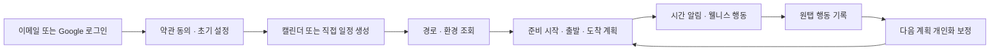

<aside>
📌

**ㅡ문서 역할:** PRD의 제품 범위, TRD의 기술 순서, API 명세의 구현 계약을 하나의 실행 계획으로 묶은 개발 기준 문서

**기준 문서:** PRD (제품 요구사항 정의서) · TRD (기술 요구사항 문서)  · API 명세서

**일정 기준:** 2026-08-17 계약 동결 · 2026-08-18~20 집중 개발 · 2026-08-21 오전 10시 제출

**일정 원본:** 🚀 프로젝트 전체 타임라인 관리

</aside>

> **개발 순서 원칙:** 가장 늦게 알게 되는 것을 가장 먼저 만든다. 개인화 정확도와 웰니스 알림 피로도는 행동 데이터가 쌓여야 검증할 수 있으므로, **계획 → 알림 → 행동 기록 → 다음 계획 보정** 순환을 가능한 빨리 닫는다.
>

## 1. 제출 성공 기준

Ensom의 제출 버전은 다음 핵심 흐름이 한 번에 연결되어야 한다.

**최종 사용자 경험:** 사용자가 일정과 장소를 등록하면 Ensom이 준비 시작 시각, 권장 출발 시각, 목표 도착 시각과 계산 근거를 보여주고, 필요한 순간에 알림을 보낸다. 사용자의 행동 결과는 다음 계획에 반영되며, 야외 노출이 있는 일정에는 의료 판단 없이 웰니스 행동을 최대 3개 제안한다.

---

## 2. 전체 일정과 마일스톤

| 단계 | 목표 일정 | 핵심 산출물 | 완료 판정 |
| --- | --- | --- | --- |
| **M0 기반 · 계약 동결** | 8월 17일 | ERD v3.1 스키마, 인증, 동의, 부트스트랩, Provider 스텁, CI | 로그인 → 일정 유입 → 스텁 경로 → 계획 생성이 E2E로 동작 |
| **M1 계획 엔진** | 8월 18일 오전 | Plan Engine, 계산 근거, 맞춤 준비 항목, 경로 후보, 골든 01~06 | 루틴을 추가하면 준비 시작 시각이 실제로 앞당겨짐 |
| **M2 행동 순환** | 8월 18일 오후~19일 오전 | 오케스트레이터, 시간 알림 3슬롯, 오프라인 행동 큐, 원인 분리 보정 | 알림 → 원탭 기록 → 다음 계획 보정이 한 바퀴 완료 |
| **M3 웰니스** | 8월 19일 오후 | WIS, 행동 매핑, 웰니스 이벤트, 승인 카피, 골든 07~09 | 야외 일정에서 행동 ≤3개, 조건 충족 시 이벤트 푸시 1회 |
| **M4 사용자 흐름 완결** | 8월 20일 오전~오후 | 기본 지도, 캘린더 저장, 출발·도착 확인, 삭제 수명주기, 일일 카드 | 로그인부터 일정 종료까지 핵심 경로가 실기기에서 중단 없이 동작 |
| **M5 경화 · 제출** | 8월 20일 저녁~21일 오전 9시 | 회귀 테스트, 시뮬레이션, 성능·배터리 점검, 콘텐츠 검토, 제출 빌드 | 알림 예산 위반 0건, 치명 버그 0건, 오전 10시 이전 제출 완료 |

<aside>
⏱️

마일스톤은 날짜보다 **완료 판정**이 우선이다. 선행 단계의 핵심 계약이 통과하지 않으면 다음 기능을 넓히지 않는다. 일정이 밀릴 경우 화면 장식이나 P1 기능을 줄이고 핵심 순환은 유지한다.

</aside>

---

## 3. M0 — 기반 · 계약 동결

**목표:** 모든 파트가 같은 데이터 모델과 API 계약 위에서 병렬 개발할 수 있게 한다.

### Backend · Data

- [x]  Flyway에 ERD v3.1 전체 스키마와 제약을 반영한다.
- [x]  M0 필수 델타 `next_eval_at`, `input_hash`, `dedup_key`, `display_label`, `from_chip`, `adjustment_reason`를 포함한다.
- [x]  이메일 인증용 `email_verified_at`, `USER_CREDENTIAL`, `AUTH_TOKEN`을 포함한다.
- [x]  원격 설정용 `ENGINE_CONFIG`를 생성하고 계산·웰니스 파라미터를 코드 상수에서 분리한다.
- [x]  `EVENT_ACTION_LOG.client_event_id`와 `NOTIFICATION.dedup_key`의 UNIQUE 제약을 실제 PostgreSQL에서 검증한다.
- [x]  폐기 패키지의 애플리케이션 코드만 제거하고 기존 DB 테이블 드롭은 제출 이후로 미룬다.

### Backend · API

- [x]  이메일 가입·인증·로그인과 Google 로그인, JWT 발급·갱신·로그아웃을 구현한다.
- [x]  `POST /consents`, `POST /push-devices`, `GET /me/bootstrap`을 구현한다.
- [x]  캘린더, 경로, 환경 Provider 인터페이스와 스텁을 만든다.
- [x]  모든 쓰기 API에 `Idempotency-Key` 공통 처리를 적용한다.
- [ ]  타 사용자 자원 접근을 404로 처리하는 행 수준 접근 테스트를 추가한다.

### Frontend : **`feat/fe-auth-onboarding` — PR #11 머지 완료**

- [x]  로그인, 약관, 이메일 인증 안내, Secure Storage 세션 관리를 구현한다.
- [x]  홈·지도·캘린더·설정 4탭 스캐폴딩을 만든다.
- [x]  `/me/bootstrap` 응답으로 초기 화면을 그리는 상태 구조를 확정한다.
- [x]  API 공통 오류, 재시도 가능 여부, 오프라인 상태를 구분해 처리한다.

| **체크리스트** | **상태** | **근거** |
| --- | --- | --- |
| 로그인 (이메일 + Google) | ✓ 화면 완성 / ⚠️ **API 미연동** | `AuthScreen`, `EmailLoginScreen`, `EmailSignupScreen` 존재하나 모두 `// TODO: 실제 API 연결` 상태 |
| 이메일 인증 안내 화면 | ✓ 완료 | `EmailVerificationScreen` 존재 |
| 약관 동의 | ✓ 화면 완성 / ⚠️ **API 미연동** | `ConsentScreen` — `// TODO: POST /consents 연동` |
| Secure Storage 세션 관리 | ✓ 완료 | `SecureStorageService` — accessToken/refreshToken/userId 관리 |
| 홈·지도·캘린더·설정 4탭 스캐폴딩 | ✓ 완료 | `app_router.dart` — `StatefulShellRoute.indexedStack` 4탭 |
| 공통 API 클라이언트 (Idempotency-Key, 재시도) | ✓ 완료 | `ApiClient` — Idempotency-Key 재시도 재사용, refresh 갱신 |
| `/me/bootstrap` 응답으로 초기 화면 렌더 | ✗ **미구현** | bootstrap 호출 코드 없음 |
| API 공통 오류·재시도·오프라인 상태 구분 | ⚠️ **부분** | `ApiException.retryable` 존재하나 오프라인 vs 인증실패 구분 로직 미구현 |

### 완료 판정

- [ ]  신규 사용자가 로그인하고 약관에 동의할 수 있다.
- [ ]  일정 1건이 서버로 유입되고 스텁 경로로 활성 계획 1건이 생성된다.
- [ ]  FE와 BE가 같은 enum, 필드명, 시간 형식으로 통신한다.
- [ ]  CI에서 빌드, 단위 테스트, Flyway 마이그레이션이 통과한다.

---

## 4. M1 — 계획 엔진

**목표:** Ensom의 핵심 가치인 “언제 준비를 시작해야 하는지”를 근거와 함께 계산한다.

### Backend

- [x]  Spring과 JPA에 의존하지 않는 순수 `PlanEngine.compute()`를 구현한다.
- [x]  목표 도착 → 권장 출발 → 준비 시작 → 제약 해결 → 체크리스트 합성의 5단계를 구현한다.
- [x]  `estimatedPrepMinutes`, `extraPrepMinutes`, `personalRoutineMinutes`, `travelMinutes`, `trafficBufferMinutes`를 분해 저장한다.
- [x]  계산 결과에 `reasons`, `feasible`, `predictionConfidence`, `degraded`를 항상 포함한다.
- [x]  맞춤 준비 규칙 `/prep-items` CRUD와 준비 항목 3단 투영을 구현한다.
- [ ]  ODsay 경로 후보 3종과 카카오맵 렌더 계약을 연결한다.
- [ ]  기상청 또는 에어코리아 Provider 최소 1종을 실제 데이터로 연결한다.

### Frontend : **`feat/fe-plan-route` — PR #13 (미머지)**

- [ ]  준비 시간 입력과 맞춤 준비 항목을 한 화면 흐름으로 구성한다.
- [ ]  일반 준비물, 영양제, 기호 품목, 시간 소요 루틴을 등록할 수 있게 한다.
- [x]  맞춤 항목 입력은 선택 사항이며 건너뛰어도 온보딩을 완료할 수 있게 한다.
- [x]  계획 카드에 준비 시작, 권장 출발, 목표 도착과 계산 근거를 표시한다.
- [x]  기본 경로, 최소 도보, 최소 환승 후보를 선택하면 새 계획 리비전을 반영한다.

| **체크리스트** | **상태** | **근거** |
| --- | --- | --- |
| 준비시간 입력 + 맞춤 준비 항목 한 화면 흐름 | ✓ 화면 완성 / ⚠️ **API 미연동** | `PrepTimeEntryScreen` — 칩 선택 UI 완성, `// TODO: PATCH /me/settings`, `// TODO: POST /prep-items` |
| 일반 준비물, 영양제, 기호 품목, 시간 소요 루틴 등록 | ⚠️ **부분** | 칩에 carry/consume/purchase 있으나 **`timed_routine`(시간 소요 루틴) UI는 이 화면에 미포함** ("설정에서 추가하도록" 주석) |
| 맞춤 항목은 선택 사항 — 건너뛰어도 온보딩 완료 | ✓ 완료 | `_skip()` 함수 존재 |
| 계획 카드: 준비 시작, 권장 출발, 목표 도착 + 계산 근거 | ✓ 완료 | `PlanCard` — 3시각 + `_BreakdownSummary` + `ReasonSection` + `degraded` 표시 |
| 경로 3종 선택 → 새 리비전 반영 | ✓ 완료 | `RouteSelectionScreen` + `PlanController.selectRoute` → API `/plans/{id}/routes/select` |

### AI · Data · 검증

- [ ]  골든 01 기본 도착 역산
- [ ]  골든 02 강수 가산과 우산 항목
- [ ]  골든 03 시간 루틴이 준비 시각을 앞당김
- [ ]  골든 04 준비물은 시간에 영향을 주지 않음
- [ ]  골든 05 출발 시각 기준 정방향 계산
- [ ]  골든 06 제약 충돌 시 `feasible=false`
- [ ]  ArchUnit으로 계산 계층의 Spring, JPA, `Instant.now()` 의존을 차단한다.

### 완료 판정

- [ ]  PRD의 계산 예시가 골든 테스트로 재현된다.
- [ ]  10분짜리 루틴을 추가하면 준비 시작 시각이 정확히 10분 앞당겨진다.
- [ ]  경로 또는 환경 데이터가 없어도 마지막 값이나 기본값으로 시간 계획은 반환된다.
- [ ]  사용자가 지정한 장소와 값이 자동 분류 결과보다 우선한다.

---

## 5. M2 — 알림 · 행동 · 개인화 순환

**목표:** 계획이 화면에 머무르지 않고 행동을 만들며, 행동 결과가 다음 계획을 바꾸게 한다.

### Backend

- [ ]  `next_eval_at`과 `FOR UPDATE SKIP LOCKED` 기반 30초 틱 오케스트레이터를 구현한다.
- [ ]  여유 A, 극한 B, 돌발 C 시간 알림과 일정당 3회 예산을 구현한다.
- [ ]  아웃박스 순서와 `dedup_key`로 중복 발송을 구조적으로 차단한다.
- [ ]  `POST /plans/{planId}/actions` 배치 입력과 `clientEventId` 중복 흡수를 구현한다.
- [ ]  상태 입력 시 남은 예약 알림을 취소하고 일정 상태를 원자적으로 전이한다.
- [ ]  준비 지연, 준비 초과, 출발 지연, 교통 지연을 분리해 한 관측이 한 손잡이만 조정하게 한다.
- [ ]  보정값에 하한, 상한, 1회 변화 제한과 되돌리기 표본 제외를 적용한다.

### Frontend : **`feat/fe-notification-offline` — PR #16  머지 완**

- [x]  홈에서 다음 일정과 계획 상태를 표시한다.
- [x]  준비 시작, 미루기, 출발, 제외를 원탭으로 기록한다.
- [x]  Drift 기반 오프라인 큐를 앱 종료 후에도 유지하고 재연결 시 재전송한다.
- [ ]  준비 시작과 출발 임박 2건을 로컬 알림으로 사전 예약한다.
- [ ]  서버 푸시가 먼저 도착하면 같은 식별자의 로컬 알림을 취소한다.
- [ ]  보정된 계획과 “왜 바뀌었는지”를 홈과 계획 상세에서 보여준다.⚠️

| **체크리스트** | **상태** | **근거** |
| --- | --- | --- |
| 푸시 수신 + 원탭 액션 처리 | ✗ **미구현** | `firebase_messaging` 패키지만 추가, Firebase 프로젝트 미연결로 초기화 코드 없음 |
| Drift 기반 오프라인 큐 (앱 종료 후 유지, 재연결 시 재전송) | ✓ 완료 | `OfflineActionQueueService` — Drift DB, `enqueue`→`flushAll`, JSON 직렬화 |
| 준비 시작·출발 임박 2건 로컬 알림 예약 | ✗ **미구현** | `flutter_local_notifications` 패키지만 추가, PR 본문에 "아직 미구현" 명시 |
| 서버 푸시 먼저 도착 시 동일 dedupKey 로컬 알림 취소 | ✗ **미구현** | 위와 동일 — 로컬 알림 자체가 미구현 |
| 홈에서 다음 일정과 계획 상태 표시 | ✓ 완료 | `HomeScreen` — `nextEventProvider` + `planControllerProvider` |
| 준비 시작·미루기·출발·제외 원탭 기록 | ✓ 완료 | `_enqueueAndMaybeRefresh` — prepStarted/departed/snoozed/excluded 4종 |
| 보정된 계획 "왜 바뀌었는지" 표시 | ⚠️ **부분** | `ReasonSection`에 `adjusted: true` 항목을 강조 표시하나, **리비전 변경 시 "이전과 비교해 무엇이 바뀌었는지" UI는 없음** |

### AI · Data · 검증

- [ ]  교통 지연만 있는 시퀀스에서 준비 시간 추정이 변하지 않는지 검증한다.
- [ ]  준비 시간 추정이 하한 10분, 시드의 2배, 1회 15분 변화 범위를 넘지 않는지 검증한다.
- [ ]  동일 행동 이벤트를 여러 번 전송해도 한 번만 학습되는지 검증한다.
- [ ]  알림 반응, 출발 편차, 도착 결과, 보정·되돌림 지표 이벤트를 적재한다.

### 완료 판정

- [ ]  시간 알림을 눌러 행동을 기록하면 일정 상태가 변경된다.
- [ ]  같은 이벤트를 재전송해도 기록과 개인화 표본이 중복되지 않는다.
- [ ]  완료된 일정의 결과가 다음 일정의 준비 시간 또는 버퍼에 원인별로 반영된다.
- [ ]  한 일정의 시간 푸시가 3회를 초과하지 않는다.

---

## 6. M3 — 웰니스 엔진

**목표:** 지각 방지 앱이 아니라, 야외 노출과 촉박함을 관리하는 AI 웰니스 일정관리 비서의 차별점을 완성한다.

### Backend · AI

- [ ]  WIS의 U, P, T, O, M 정규화와 가중치 버전을 구현한다.
- [ ]  ODsay 도보 구간 중 지상 도보만 `estimatedOutdoorMinutes`로 집계한다.
- [ ]  WIS 밴드 low, mid, high와 행동 매핑을 구현한다.
- [ ]  맞춤 항목과 웰니스 행동이 중복될 때 1건으로 병합하고 근거를 유지한다.
- [ ]  준비 카드에 노출하는 웰니스 행동을 최대 3개로 제한한다.
- [ ]  웰니스 이벤트의 6중 게이트를 구현한다: 사용자 동의, 항목 활성화, WIS 기준, 야외 노출 지속, 사용자 설정 주기, 일일 상한.
- [ ]  `completed`, `snoozed`, `stop_today`, `ignored` 응답과 백오프를 구현한다.
- [ ]  승인 템플릿 이외 문자열이 알림·카드에 들어갈 수 없게 한다.

### Frontend · Planning : **`feat/fe-wellness` — PR #18 오픈 (미머지)**

- [x]  사용자 맞춤 준비물과 웰니스 행동을 출처가 구분되도록 표시한다.
- [x]  UV, 미세먼지, 기온, 강수, 수분 관심 항목과 재알림 주기를 설정할 수 있게 한다.
- [ ]  민감 준비 항목은 잠금화면과 푸시에서 일반화된 문구로 치환한다.
- [x]  선크림 재확인 등 이벤트 알림에 “사용자가 설정한 시간이 지났다면”과 같은 비의료적 표현을 사용한다.
- [ ]  진단, 치료, 용량, 효능 보장, 피부 상태 판정 표현을 금지하는 카피 사전을 확정한다.

| **체크리스트** | **상태** | **근거** |
| --- | --- | --- |
| 웰니스 행동 카드 (출처 구분: 맞춤 vs 웰니스) | ✓ 완료 | `WellnessActionsSection` (별도 배열) + `ChecklistSection` (맞춤 항목) 분리 |
| UV/미세먼지/기온/강수/수분 관심 항목 + 재알림 주기 설정 | ✓ 완료 | `WellnessPrefsScreen` — 5항목 토글 + 30~240분 슬라이더 |
| 이벤트 알림 응답 (완료/미루기/오늘은 그만) | ✓ 완료 | `respondToNotification` — action 매핑 (completed/snoozed/stop_today/ignored) |
| 일일 마무리 카드 | ✓ 완료 | `DailySummaryScreen` — DWL 등급만 노출, 0건이면 빈 상태 |
| 민감 준비 항목은 잠금화면·푸시에서 일반화 문구로 치환 | ⚠️ **부분** | `ChecklistSection`에서 `isSensitive → "개인 준비"` 치환 O, 하지만 **실제 푸시 알림이 미구현이라 잠금화면 마스킹 검증 불가** |
| 비의료적 카피만 사용 | ✓ 완료 | 서버 문구를 그대로 표시 (TR-09). 클라이언트가 재구성하지 않음 |

### 검증

- [ ]  골든 07 환경 데이터 부재 시 웰니스 생략, 시간 계획 정상
- [ ]  골든 08 WIS 밴드 경계
- [ ]  골든 09 사용자 선크림과 웰니스 선크림 병합
- [ ]  `wisScore < 70`이면 웰니스 이벤트 후보가 생성되지 않는지 검증한다.
- [ ]  `stop_today` 이후 당일 같은 행동 알림이 0건인지 검증한다.

### 완료 판정

- [ ]  야외 일정에서 근거가 포함된 웰니스 행동이 최대 3개 노출된다.
- [ ]  환경 데이터가 없을 때 시간 계획은 정상 동작하고 웰니스만 조용히 생략된다.
- [ ]  조건을 모두 충족한 경우에만 일정당 웰니스 푸시 1회가 발생한다.
- [ ]  자유 생성 모델 없이 승인 템플릿만 사용자에게 노출된다.

---

## 7. M4 — 사용자 흐름 완결

**목표:** 개별 엔진을 실제 앱의 처음부터 끝까지 연결하고, 권한 거부와 실패 상황에서도 사용 가능한 경로를 남긴다.

### 기능 완결

- [ ]  지도 화면은 목적지 검색, 기본 경로 표시, 경로 선택, 캘린더 저장에 집중한다.
- [ ]  환경 레이어, 센서 시각화, 자체 경로 점수, 복잡한 인터랙티브 레이어는 넣지 않는다.
- [ ]  활성 계획 1건에 출발지 EXIT와 목적지 ENTER 2개 리전만 등록한다.
- [ ]  지오펜스 콜백은 좌표를 보내지 않고 판정 종류, 시각, 신뢰도만 행동 API로 보낸다.
- [ ]  위치 권한이 없거나 판정이 불확실하면 “출발했어요”, “도착했어요” 수동 버튼을 제공한다.
- [ ]  외부 캘린더 제목 원문은 분류 후 폐기하고 사용자가 입력·승인한 `displayLabel`만 저장한다.
- [ ]  로그아웃, 개인화 초기화, 탈퇴의 데이터 처리 범위를 분리한다.
- [ ]  일일 마무리 카드는 일정이 있는 날에만 생성하며 DWL 숫자가 아닌 등급과 설명을 표시한다.

### E2E 시나리오

- [ ]  이메일 가입 → 인증 → 약관 → 온보딩 → 일정 생성 → 계획 확인
- [ ]  Google 로그인 → 캘린더 연결 → 일정 유입 → 계획 확인
- [ ]  지도 검색 → 경로 선택 → 일정명과 함께 캘린더 저장
- [ ]  알림 → 준비 시작 → 출발 → 도착 → 결과 확정 → 다음 계획 보정
- [ ]  야외 일정 → 웰니스 행동 → 이벤트 응답 → 일일 카드
- [ ]  오프라인 행동 기록 → 앱 재시작 → 재연결 → 중복 없는 동기화
- [ ]  위치·알림·캘린더 권한 거부 상태에서 수동 대체 경로

### 완료 판정

- [ ]  핵심 E2E 시나리오가 실기기에서 중단 없이 완료된다.
- [ ]  외부 일정 제목, 전체 이동 경로, 민감 준비 항목명이 로그에 남지 않는다.
- [x]  탈퇴 후 동의 이력을 제외한 사용자 데이터가 남지 않는다.
- [ ]  지도 범위가 기본 경로 기능을 넘지 않는다.

---

## 8. M5 — 경화 · 제출

**목표:** 데모가 아니라 반복 실행 가능한 제출 빌드를 만든다.

### 품질과 성능

- [ ]  Plan Engine과 Wellness Engine 골든 테스트를 모두 통과한다.
- [ ]  PostgreSQL 16 Testcontainers에서 부분 유니크, CHECK, 복합 FK를 검증한다.
- [ ]  가상 시계로 일정 200건 하루 시뮬레이션을 실행한다.
- [ ]  시간 푸시 ≤3회, 웰니스 푸시 ≤1회, 중복 키 0건을 확인한다.
- [ ]  상태 입력 후 남은 예약 알림이 0건인지 확인한다.
- [ ]  계획 생성 p95 5초, WIS 계산 p95 2초, 캐시 재계산 p95 400ms 목표를 측정한다.
- [ ]  고사양 iOS, 중급 Android, 저가 Android에서 기본 흐름을 점검한다.
- [ ]  지오펜스 오판, 배터리 추가 소모, 푸시 지연을 기록한다.

### 안전 · 프라이버시

- [ ]  의료적 해석으로 읽힐 수 있는 웰니스 문구를 전수 검토한다.
- [ ]  잠금화면 민감 항목 마스킹을 실기기에서 확인한다.
- [ ]  캘린더 제목 원문 24시간 상한 폐기 배치를 확인한다.
- [ ]  로그의 좌표, 제목, 준비 항목명 차단 규칙을 확인한다.
- [ ]  계정 열거 방지, 비밀번호 잠금, 인증·재설정 토큰 단회 사용을 확인한다.

### 제출 패키지

- [ ]  Android 또는 iOS 제출 빌드와 설치 방법
- [ ]  데모 계정과 데모 일정 데이터
- [ ]  핵심 흐름 데모 시나리오
- [ ]  아키텍처, ERD, API, 개인정보 처리 설명
- [ ]  알려진 제한과 저하 동작 목록
- [ ]  오전 9시 최종 점검, 오전 10시 이전 제출

### 완료 판정

- [ ]  치명도 높음 버그 0건
- [ ]  핵심 E2E 실패 0건
- [ ]  알림 예산 위반 0건
- [ ]  콘텐츠 검토 미통과 문구 0건
- [ ]  제출 파일과 링크 접근 가능 여부 확인 완료

---

## 9. API 구현 배치

| 단계 | API 묶음 | FE가 병렬로 사용할 계약 |
| --- | --- | --- |
| **M0** | `/auth/email/*`, `/auth/password/*`, `/auth/login`, `/auth/refresh`, `/auth/logout`, `/consents`, `/push-devices`, `/me/bootstrap` | 인증 상태, 동의 필요 항목, 사용자·설정 초기 상태 |
| **M1** | `/me/settings`, `/places`, `/prep-items`, `/calendar/*`, `/events/*`, `/plans/*`, `/routes/search` | 일정, 계획 3개 시각, breakdown, reasons, checklist, route options |
| **M2** | `/notifications/today`, `/notifications/{id}/respond`, `/plans/{id}/actions`, `/events/{id}/execution`, `/events/{id}/feedback`, `/me/personalization*` | 알림 슬롯, 오프라인 행동 배치, 일정 상태, 보정 사유 |
| **M3** | `/me/wellness-prefs`, `/plans/{id}/prep-items/{itemId}/resolve`, `/plans/{id}/wellness-actions/{actionId}/resolve` | WIS, wellnessActions, context, 이벤트 활성 여부 |
| **M4** | `/summary/daily`, `/summary/daily/{id}/viewed`, `DELETE /me/personalization`, `DELETE /me` | 일일 카드, 삭제 결과, 보존 항목 |

**계약 고정 규칙**

- 요청·응답은 camelCase, DB는 snake_case를 사용한다.
- 모든 시각은 오프셋이 포함된 ISO-8601을 사용한다.
- 모든 쓰기는 `Idempotency-Key`를 받는다.
- 행동 이벤트는 별도의 `clientEventId`를 반드시 가진다.
- 계획 응답에는 시각만이 아니라 `breakdown`, `reasons`, `degraded`가 함께 있어야 한다.
- `planStatus`와 `eventStatus`는 다른 생명주기이므로 하나로 합치지 않는다.

---

## 10. 파트별 책임과 교차 검증

| 파트 | 주 책임 | 반드시 함께 검증할 파트 |
| --- | --- | --- |
| **Frontend** | 화면 흐름, Riverpod 상태, Drift 큐, 로컬 알림, 지오펜스, 권한 폴백 | BE와 API 계약·알림 중복, 기획과 민감 문구 |
| **Backend** | 스키마, 인증, Plan·Wellness Engine, 오케스트레이터, Provider, 트랜잭션 | FE와 상태 전이, AI·Data와 계산·보정 불변식 |
| **AI · Data** | 골든 픽스처, WIS 정규화, 원인 분리 보정, 지표, 시뮬레이션 | BE와 순수 함수·버전, 기획과 지표 해석 경계 |
| **기획 · 디자인 · 콘텐츠** | 우선순위, 사용자 흐름, 승인 카피, 의료 경계, 데모 시나리오 | FE와 노출 맥락, AI·Data와 실험·성공 지표 |
| **교차 QA** | 전담 QA 없이 자기 코드가 아닌 영역을 상호 검증 | 골든은 AI·Data, 지오펜스는 FE·BE 교차, 카피는 기획, E2E는 전원 |

---

## 11. 선행 의존관계와 결정 게이트

| 게이트 | 선행 조건 | 통과 후 가능한 작업 | 실패 시 조치 |
| --- | --- | --- | --- |
| **G0 계약 동결** | ERD v3.1, enum, 오류 코드, 시간 규약 확정 | FE·BE 병렬 구현 | 필드 추가는 문서 3종을 함께 수정 |
| **G1 계획 엔진** | 골든 01~06 통과 | 알림 예약과 홈 계획 카드 | 알림 구현보다 계산 회귀를 먼저 수정 |
| **G2 행동 수집** | 오프라인 큐, 멱등성, 상태 전이 통과 | 개인화 보정 | 학습을 끄고 기록만 유지 |
| **G3 웰니스 입력** | 경로의 지상 도보와 환경 스냅샷 확보 | WIS와 웰니스 행동 | 웰니스를 생략하고 시간 계획은 유지 |
| **G4 알림 안전** | 6중 게이트, 예산, 승인 카피 통과 | 웰니스 이벤트 푸시 활성화 | 카드만 노출하고 이벤트 푸시는 비활성 |
| **G5 제출** | 핵심 E2E, 개인정보, 회귀, 빌드 검증 | 제출 및 데모 | P1 기능을 끄고 안정 빌드로 롤백 |

---

## 12. 병행 트랙

### 사용자 조사

- [ ]  기존 사전 설문 결과를 M0 종료 전 요약한다.
- [ ]  “준비 시작 시점 계산”과 “웰니스 행동 제안”이 실제 문제인지 분리해 확인한다.
- [ ]  알림 피로 우려가 높으면 M2에서 기본 민감도를 낮추고 M3 이벤트 푸시를 opt-in으로 유지한다.

### 웰니스 이벤트 실험

- [ ]  M3 완료 직후 카드만 노출, 시간 기반 푸시, 이벤트 기반 푸시의 A/B/C 프로토타입을 확인한다.
- [ ]  제출 전에는 오류와 거부 반응을 찾는 스모크 테스트로 사용하고, 통계적 효과 검증은 베타 데이터로 이어간다.
- [ ]  C군이 불필요하다는 반응이 많으면 M4 제출 빌드에서 이벤트 푸시를 기본 비활성화하고 카드 경험만 유지한다.

---

## 13. 범위 가드레일

### 제출 P0에서 반드시 지킬 것

- 로그인·동의·일정·계획·계산 근거
- 맞춤 준비 항목과 시간 소요 루틴
- 기본 경로 3종과 지도 렌더
- 시간 알림, 행동 기록, 오프라인 멱등성
- 원인 분리 개인화의 최소 순환
- WIS와 최대 3개 웰니스 행동
- 민감 정보 마스킹과 삭제 수명주기

### 핵심 흐름이 위험할 때 뒤로 미룰 것

- 유형별 개인화 모델
- 조건부 맞춤 준비 규칙 자동 적용
- 일일 카드의 고급 통계와 주간 리포트
- Apple 로그인 추가 구현 — 심사 요구가 확인된 경우에만 진행
- 장기 A/B 실험 자동화와 별도 분석 인프라

### 구현하지 않을 것

- 지도 환경 레이어와 센서 시각화
- 자체 경로 점수와 복잡한 지도 인터랙션
- 웰니스 카피 자유 생성 LLM
- 건강 진단, 치료, 섭취량, 효능, 피부 상태 판단
- 외부 캘린더 제목 원문 장기 저장
- 하루 전체 위치·이동 경로 저장
- 제출 규모에서 메시지 브로커, 별도 배치 프레임워크, 대형 분석 스택 도입

---

## 14. 진행 상태 운영 규칙

1. 각 작업은 **완료 판정이 검증된 경우에만 완료**로 변경한다.
2. API 필드나 enum 변경은 FE와 BE가 동시에 확인하고 PRD·TRD·API 명세의 추적 관계를 갱신한다.
3. 매일 종료 시 `완료`, `다음 작업`, `막힌 점`, `결정 필요` 네 항목으로 상태를 남긴다.
4. 치명 버그는 새 기능보다 우선한다. 제출 전날에는 신규 범위를 추가하지 않는다.
5. P1 기능은 기능 플래그로 끌 수 있어야 하며, 제출 빌드는 핵심 P0 흐름만으로도 동작해야 한다.
6. 데모 시나리오에 없는 기능은 핵심 흐름이 안정된 뒤에만 개발한다.

<aside>
✅

**최종 체크:** 사용자는 늦지 않아야 할 뿐 아니라 서두르지 않아야 한다. 계획 정확도, 설명 가능성, 알림 피로, 민감 정보 보호 중 하나라도 무너지면 기능이 많아도 Ensom의 제품 가치는 완성되지 않은 것으로 본다.

</aside>

---

## 역할 분담 · 기능별 브랜치 운영

<aside>
🌿

**운영 원칙:** 사람 이름으로 장기간 유지하는 브랜치를 만들지 않고, 기능 단위의 짧은 브랜치를 `develop`에서 분기한다. 각 브랜치는 한 명의 주 담당자가 소유하고, 다른 담당자는 리뷰어로 참여한다.

**레포가 FE · BE · AI로 분리되어 있어도 아래 기능명을 동일하게 사용한다.** 마일스톤에서는 구분을 쉽게 하기 위해 `fe-`, `be-`, `ai-` 접두어를 표기한다.

</aside>

### 1. 고정 역할과 최종 책임

| 구성원 | 주 역할 | 주요 소유 영역 | 최종 책임 |
| --- | --- | --- | --- |
| **유채연** | Frontend | Flutter 화면 · Riverpod 상태 · Drift 오프라인 큐 · 푸시 액션 · 로컬 알림 · 지오펜스 클라이언트 | 클라이언트 통합 및 실기기 흐름 |
| **박찬** | Backend Platform | 인증 · 공통 API · 외부 Provider · 캘린더 동기화 · 오케스트레이터 · 알림 · FCM · 배포 | 기술 통합 및 릴리스 매니저 |
| **김민형** | Backend Core · Data | Flyway · JPA 도메인 · 일정/계획 · 준비 규칙 · 행동/결과 · 개인화 저장 · 웰니스 API | DB 스키마 및 핵심 도메인 정합성 |
| **이지호** | AI · Algorithm · Data | Plan Engine 순수 계산 · 원인 분리 보정 · WIS/RLS/DWL · 골든 테스트 · 속성 테스트 · 시뮬레이션 | 알고리즘 정확도와 실험 지표 |
| 최수민 | 기획 · Product Owner | P0/P1 범위 · 인수 조건 · 알림/웰니스 카피 · 실험 설계 · UAT · 제출 체크 | 범위 동결 및 제품 승인 |
| 최영원 | UX/UI Design | 디자인 시스템 · 화면/상태 설계 · 프로토타입 · 개발 핸드오프 · 비주얼 QA | 디자인 승인 및 사용성 정합성 |

### 2. 브랜치 구조

| 브랜치 | 용도 | 규칙 |
| --- | --- | --- |
| `main` | 제출 및 배포 가능한 안정 버전 | 직접 push 금지 · release PR만 병합 |
| `develop` | 기능 통합 기준 | 모든 기능 브랜치는 여기에서 분기하고 여기로 PR |
| `release/2026-central-hackathon` | 제출 직전 안정화 | M4 완료 후 생성 · 신규 기능 금지 · 버그 수정만 허용 |
| `feat/<area>-<feature>` | 기능 구현 | 예: `feat/be-event-plan`, `feat/fe-plan-route` |
| `fix/<area>-<issue>` | 통합 또는 릴리스 버그 수정 | 한 브랜치에 한 결함만 포함 |
| `docs/<feature>` | 기획 · 계약 · 카피 · UAT 문서 | 구현 인수 조건과 함께 병합 |
| `design/<feature>` | 디자인 명세 · 에셋 · 핸드오프 | Figma 링크와 상태별 캡처를 PR에 첨부 |
| `test/<feature>` | 골든 · 시뮬레이션 · 성능 검증 | 기능 코드와 독립적으로 재실행 가능해야 함 |

### 3. 코드 소유 경계

- **박찬:** `auth`, `provider`, `calendar`, `orchestrator`, `notification`, 공통 보안·멱등성, CI/CD 영역을 주로 수정한다.
- **김민형:** Flyway, Entity/Repository, `event`, `plan`, `preprule`, 행동·결과, 개인화·웰니스의 영속화와 Controller/Service를 주로 수정한다.
- **이지호:** `planengine/core`, `personalization/core`, `wellness/core`, 골든 픽스처, 시뮬레이션만 소유한다. Spring Controller·Repository는 직접 수정하지 않고 인터페이스와 순수 함수로 전달한다.
- **유채연:** Flutter의 `features/auth`, `features/plan`, `features/notification`, `features/wellness`, `features/map`, `features/settings`를 기능별로 분리한다.
- **최수민 · 최영원:** 구현 코드 대신 인수 조건, 카피, 화면 상태, 에셋과 핸드오프를 기능 브랜치에 선행 제공한다.

<aside>
⚠️

AI와 Backend가 같은 계산 파일을 동시에 수정하지 않는다. **이지호가 순수 계산 모듈과 테스트를 먼저 병합하고, 김민형이 Service · Repository · API에 연결한다.** 급한 경우에도 인터페이스 스텁을 먼저 합의한 뒤 각자 영역에서 작업한다.

</aside>

### 4. M0 — 기반 · 계약 동결 브랜치

- [ ]  `chore/be-schema-core` — **김민형**
    - ERD v3.1 Flyway, JPA 매핑, `ENGINE_CONFIG`, 필수 델타, UNIQUE/CHECK 제약, Testcontainers 검증
    - 리뷰어: **박찬**
- [ ]  `feat/be-auth-platform` — **박찬**
    - 이메일·Google 인증, JWT, 약관, 푸시 기기, `/me/bootstrap`, 공통 오류·멱등성, Provider 스텁
    - 리뷰어: **김민형**
- [x]  `feat/fe-auth-onboarding` — **유채연**
    - 로그인, 이메일 인증 안내, 약관, 준비시간 입력 진입, Secure Storage, 4탭 스캐폴딩, 공통 API 클라이언트
    - 계약 리뷰: **박찬** · 디자인 리뷰: **최영원**
- [ ]  `feat/ai-engine-contracts` — **이지호**
    - Plan/Personalization/Wellness 입력·출력 계약, 원격 설정 초기값, 골든 픽스처 형식, 가상 시계 하네스 골격
    - 기술 리뷰: **김민형** · 제품 검증: **최수민**
- [ ]  `docs/product-contract` — **최수민**
    - P0/P1 범위, 화면별 인수 조건, enum·용어·알림 예산, 범위 제외 항목 동결
    - 리뷰어: 전원
- [ ]  `design/system-onboarding` — **최영원**
    - 디자인 토큰, 공통 컴포넌트, 로그인·약관·준비시간 화면, 오류·로딩·오프라인 상태
    - 구현 리뷰: **유채연** · 제품 리뷰: **최수민**

**M0 병합 순서:** `docs/product-contract` → `chore/be-schema-core`·`feat/ai-engine-contracts`·`design/system-onboarding` → 인증/FE 구현 → `develop` E2E 확인.

### 5. M1 — 계획 엔진 브랜치

- [ ]  `feat/ai-plan-engine` — **이지호**
    - 목표 도착 → 권장 출발 → 준비 시작 → 제약 해결 → 체크리스트 합성의 순수 계산
    - 골든 01~06, 시간 계산 불변식, `feasible`·`degraded` 판정
    - 리뷰어: **김민형** · 계산 예시 승인: **최수민**
- [ ]  `feat/be-event-plan` — **김민형**
    - 일정/계획 리비전, `/prep-items`, 계획 근거, 체크리스트 투영, 경로 선택, 사용자 수정 API
    - 선행: `chore/be-schema-core`, `feat/ai-plan-engine`
    - 리뷰어: **박찬**
- [ ]  `feat/be-provider-route-env` — **박찬**
    - ODsay, 기상청, 에어코리아 어댑터, 캐시, 쿼터, 제공자 장애 시 `degraded` 처리
    - 데이터 검증: **이지호** · 리뷰어: **김민형**
- [x]  `feat/fe-plan-route` — **유채연**
    - 준비시간·맞춤 항목, 계획 카드, 계산 근거, 체크리스트, 경로 3종 선택과 리비전 갱신
    - API 리뷰: **김민형** · 디자인 리뷰: **최영원**
- [ ]  `docs/plan-acceptance-copy` — **최수민**
    - 계산 근거 문구, 데이터 부족, 계획 불가능, 사용자 수정 시나리오와 인수 조건
- [ ]  `design/plan-route` — **최영원**
    - 준비 항목 입력, 계획 카드, 근거 펼침, 경로 선택, 빈 상태·저하 상태 핸드오프

**M1 완료 판정:** AI 골든 통과 → BE 계획 API 통과 → FE에서 루틴 10분 추가 시 준비 시작이 10분 앞당겨지는 E2E 확인.

### 6. M2 — 알림 · 행동 · 개인화 브랜치

- [ ]  `feat/be-orchestrator-notification` — **박찬**
    - `next_eval_at`, `SKIP LOCKED`, 시간 알림 A/B/C, 아웃박스, FCM, `dedup_key`, 로컬 알림 계약
    - 리뷰어: **김민형**
- [ ]  `feat/be-action-personalization` — **김민형**
    - 행동 배치 수신, `clientEventId` 중복 흡수, 상태 전이, 실행 결과, 보정 이력·되돌리기 API
    - 선행: `feat/ai-personalization`
    - 리뷰어: **박찬**
- [ ]  `feat/ai-personalization` — **이지호**
    - `prep_late`, `prep_overrun`, `depart_late`, `traffic` 원인 라우팅, EMA와 가드레일, 속성 테스트
    - 리뷰어: **김민형** · 제품 검증: **최수민**
- [x]  `feat/fe-notification-offline` — **유채연**
    - 푸시 수신·원탭 액션, Drift 오프라인 큐, 앱 재시작 후 재전송, 준비·출발 로컬 알림 예약/취소
    - API 리뷰: **박찬** · 디자인 리뷰: **최영원**
- [ ]  `docs/notification-policy` — **최수민**
    - 알림 A/B/C 카피, 예산·중단 정책, 사용자 행동별 인수 조건, UAT 시나리오
- [ ]  `design/notification-states` — **최영원**
    - 잠금화면 일반 문구, 원탭 액션, 미루기·오늘은 그만, 오프라인·중복 방지 상태

**M2 완료 판정:** 알림 발송 → 원탭 행동 기록 → 다음 일정의 계획값 보정이 실제 DB와 화면에서 한 바퀴 연결됨.

### 7. M3 — 웰니스 브랜치

- [ ]  `feat/ai-wellness-engine` — **이지호**
    - WIS/RLS/DWL 정규화, 밴드, 행동 최대 3개, 사용자 항목과 중복 병합, 골든 07~09
    - 리뷰어: **김민형** · 의료 경계 검증: **최수민**
- [ ]  `feat/be-wellness-summary` — **김민형**
    - 웰니스 선호, 점수·행동 저장, 행동 완료/해제 API, 일일 마무리 카드와 피드백 영속화
    - 선행: `feat/ai-wellness-engine`
    - 리뷰어: **박찬**
- [ ]  `feat/be-wellness-scheduler` — **박찬**
    - 동의·점수·노출·주기·미완료·일일 상한 게이트, `stop_today`, 무시 백오프, 웰니스 푸시 통합
    - 리뷰어: **김민형** · 규칙 검증: **이지호**
- [x]  `feat/fe-wellness` — **유채연**
    - 웰니스 행동 카드, 항목별 설정·주기, 이벤트 알림 응답, 일일 마무리 카드
    - API 리뷰: **김민형** · 디자인 리뷰: **최영원**
- [ ]  `docs/wellness-copy-experiment` — **최수민**
    - 승인 템플릿, 금지 표현, A/B/C 실험, 완료율·반응률·적합률 기준
- [ ]  `design/wellness-summary` — **최영원**
    - 준비 전 행동 카드, 이벤트 푸시, 설정, 마무리 카드와 민감 항목 비노출 상태

**M3 완료 판정:** 야외 일정에 행동이 최대 3개 표시되고, 모든 게이트를 통과한 경우에만 웰니스 이벤트가 1회 발송됨.

### 8. M4 — 흐름 완결 브랜치

- [ ]  `feat/be-calendar-geofence` — **박찬**
    - Google Calendar 증분 동기화, 일정 변경 재계산, 지오펜스 판정 결과 수신, 외부 장애 폴백
    - 리뷰어: **김민형**
- [ ]  `feat/be-lifecycle-feedback` — **김민형**
    - 도착 결과·사후 평가, 개인화 초기화, 로그아웃·탈퇴 삭제 3단, 지표 이벤트·일일 요약 API 마무리
    - 리뷰어: **박찬**
- [ ]  `feat/fe-map-summary-settings` — **유채연**
    - 기본 지도·경로 검색·캘린더 저장, 활성 일정 지오펜스, 도착 확인, 설정·삭제·일일 카드
    - API 리뷰: **박찬/김민형** · 디자인 리뷰: **최영원**
- [ ]  `test/ai-simulation-metrics` — **이지호**
    - 가상 시계 일정 200건, 알림 예산·중복·상태 종결 검증, 제품 지표 계산 쿼리
    - 리뷰어: **박찬/김민형** · 지표 승인: **최수민**
- [ ]  `docs/release-uat` — **최수민**
    - 로그인부터 일정 종료까지 UAT, 개인정보·의료 경계 콘텐츠 검토, 제출 체크리스트, 범위 축소 결정
- [ ]  `design/release-polish` — **최영원**
    - 실기기 비주얼 QA, 빈 화면·오류·긴 텍스트·작은 기기 대응, 최종 에셋 정리

### 9. M5 — 경화 · 제출 브랜치

- [ ]  `release/2026-central-hackathon` — **박찬이 병합 관리**
    - `develop`에서 생성하고 신규 기능을 금지한다.
    - Backend/DB 승인: **김민형**
    - Frontend 실기기 승인: **유채연**
    - 알고리즘·지표 승인: **이지호**
    - 제품·콘텐츠 승인: **최수민**
    - 디자인 승인: **최영원**
- [ ]  발견된 결함은 `fix/fe-*`, `fix/be-*`, `fix/ai-*`로 각각 분리한다.
- [ ]  모든 승인 후 release → `main` PR을 병합하고 태그를 생성한다.

### 10. PR · 리뷰 규칙

1. **한 브랜치 = 한 기능 책임**으로 제한한다. 기능과 무관한 리팩터링을 함께 넣지 않는다.
2. Backend PR은 **박찬과 김민형이 서로 교차 리뷰**한다.
3. AI 계산 PR은 **김민형이 코드·계약을**, **최수민이 제품 동작을** 확인한다.
4. Frontend PR은 관련 Backend 담당자가 API 계약을 확인하고 **최영원이 화면 상태를 확인**한다.
5. 기획·디자인 PR은 실제 구현 담당자가 핸드오프 누락 여부를 확인한다.
6. PR 본문에는 마일스톤, 선행 브랜치, 테스트 결과, 스크린샷 또는 API 예시, 남은 제한사항을 기록한다.
7. `develop`과 `main` 직접 push를 금지하고, 최소 1명의 승인과 CI 통과 후 병합한다.
8. M4 이후에는 기능 추가보다 회귀 수정과 제출 안정성을 우선한다.

### 11. 파트 간 인계 기준

| 인계 | 반드시 제공할 것 |
| --- | --- |
| 기획 → 개발 | P0/P1, 인수 조건, 성공/실패/빈 상태, 노출 문구, 범위 제외 |
| 디자인 → FE | 컴포넌트 상태, 간격·타이포, 로딩·오류·오프라인, 긴 문구와 작은 화면 대응 |
| AI → BE | 입출력 DTO, 순수 함수, 설정 키, 골든 입력/출력, 예외·데이터 부재 규칙 |
| BE → FE | 요청/응답 예시, enum, 오류 코드, 멱등성 규칙, Mock JSON |
| FE → QA/기획 | 실기기 빌드, 핵심 흐름 영상 또는 캡처, 미구현·저하 기능 목록 |

<aside>
🎯

**병목 방지:** 유채연이 단일 Frontend 담당이므로 고급 지도 인터랙션과 화면 장식은 추가하지 않는다. 최영원이 화면 상태를 먼저 확정하고, Backend는 실제 구현 전 Mock JSON을 제공해 FE가 기다리지 않게 한다. 핵심 순환과 웰니스 행동이 연결되면 P1 화면보다 통합 테스트를 우선한다.

</aside>