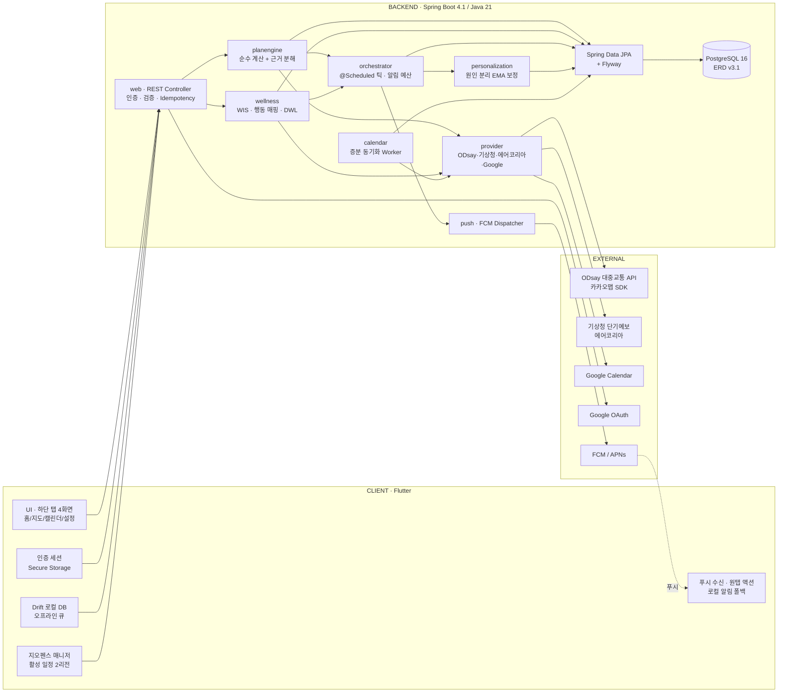
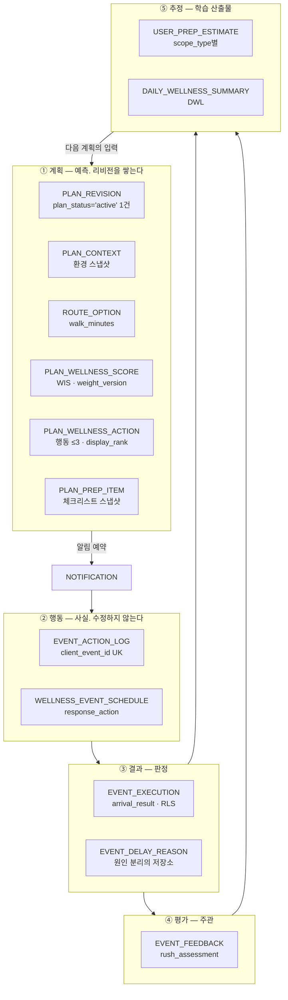
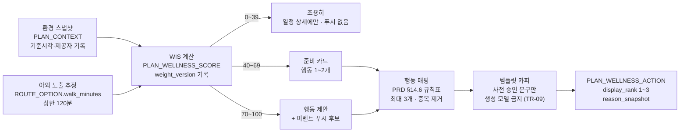
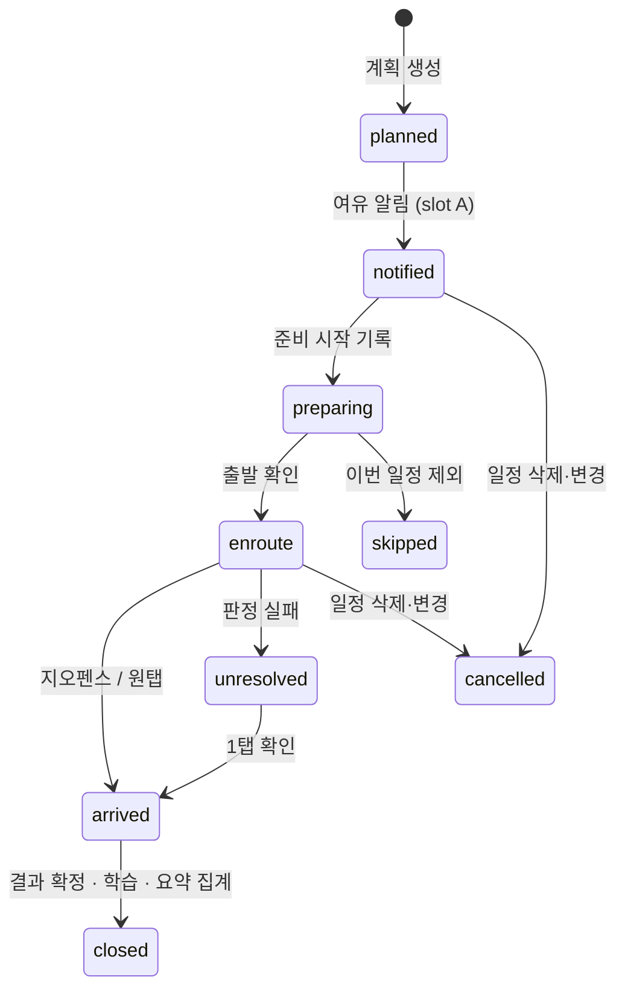

# Ensom TRD — 기술 요구사항 정의서

> **늦지 않게, 서두르지 않게.**
> AI 웰니스 일정관리 비서 Ensom

| 항목 | 내용 |
|---|---|
| 문서 버전 | v4.0 |
| 작성일 | 2026-08-17 |
| 상위 문서 | **PRD v0.4.3** — 충돌 시 PRD가 기준 |
| 참조 문서 | ERD v3.1 · API 명세서 v5.0 · MIGRATION.md · MILESTONE.md |
| 백엔드 | **Java 21 · Spring Boot 4.1.0 · PostgreSQL 16** |
| 프론트 | **Flutter · Riverpod · Drift** |
| 경로·지도 | **ODsay 대중교통 API · 카카오맵 SDK** |
| 인증 | **이메일 계정 · Google 계정** 2종 |

---

## 절대 원칙

번호는 다른 문서(MILESTONE.md 등)에서 인용하므로 재배열하지 않습니다.

| # | 원칙 | 무너지면 생기는 일 |
|---|---|---|
| **1** | **계획과 웰니스 판단의 권위는 서버가 단독으로 가진다** | 앱이 꺼진 사용자에게 제품의 핵심 가치가 사라진다 |
| **2** | **자기 보고는 시드이고, 관측된 편차가 진실이다** | 지각의 원인이 된 잘못된 추정치를 앱이 그대로 반복한다 |
| **3** | **의료 경계를 넘지 않는다** — 진단·치료·용량·효능·피부 판정 금지. WIS·RLS·DWL은 알림 우선순위 값이지 건강 점수가 아니다 | 규제 리스크. PRD §30 출시 기준(콘텐츠 검토)을 통과하지 못한다 |
| **4** | **근거 없는 계획을 반환하지 않는다** | PLAN-03과 PRD §20.4 설명가능성이 성립하지 않는다 |
| **5** | **사용자가 지정한 값이 자동 판단을 항상 이긴다** | 자동 분류 오류가 사용자 의사를 덮어쓴다 |
| **6** | **알림은 예산 안에서만 나간다** — 시간 3회 + 웰니스 1회 | 알림 피로 → 전체 차단 → 제품 사망 |
| **7** | **지도는 기본 경로 기능만 제공한다** — 환경 레이어·센서·자체 경로 점수 없음 | PRD §17.2·§18에서 종료한 논쟁이 되살아나고 M4가 무한 확장된다 |
| **8** | **원문과 경로는 오래 머무르지 않는다** — 외부 일정 제목 원문·하루 전체 이동 경로 미보관 | PRD §20.2 최소 수집 위반 |

---

## 목차

| | | | |
|---|---|---|---|
| 1 | 문서 개요 | 11 | 외부 연동 계층 |
| 2 | 시스템 아키텍처 | 12 | API 명세 |
| 3 | 기술 스택 | 13 | 트랜잭션 · 동시성 · 복구 |
| 4 | 데이터 설계 | 14 | 프라이버시 엔지니어링 |
| 5 | Plan Engine | 15 | 성능 예산과 SLO |
| 6 | 개인화 — 원인 분리 보정 | 16 | 관측성과 지표 수집 |
| 7 | 웰니스 엔진 — WIS · RLS · DWL | 17 | 테스트 전략 |
| 8 | 알림 오케스트레이션 | 18 | 마일스톤과 개발 순서 |
| 9 | 출발·도착 확인 | 19 | 기술 위험과 대응 |
| 10 | 인증과 회원 수명주기 | 20 | 확정된 기술 결정 (D1~D17) |
| | | A · B | 파라미터 · 요구사항 추적 |

**역할별 읽는 순서**

| 역할 | 먼저 읽을 절 |
|---|---|
| **BE** | §3 스택 → §4 데이터 → §5 엔진 → §8 알림 → §13 트랜잭션 → §12 API |
| **FE** | §2 아키텍처 → §10 인증 → §12 API → §9 지오펜스 → §15 성능 예산 |
| **AI · 데이터** | §5~§9 → §6 보정 → §16 지표 → §17.2 골든 |
| **QA** | §17 테스트 → §15 SLO → §19 위험 → 부록 B |
| **기획** | 절대 원칙 → §18 마일스톤 → §20 결정 대장 |

인용 표기: PRD는 `PRD §14.3`, ERD는 `ERD §3`, 기능 요구사항은 `WELL-02`. 본 문서가 정의한 기술 요구사항은 `TR-xx`이며 부록 B 말미에 모았습니다.

---

## 1. 문서 개요

### 1.1 문서 체계

ERD는 **무엇을 저장할지**를, PRD는 **무엇을 만들지**를 정의합니다. 본 TRD는 그 사이를 채웁니다 — **어떤 컴포넌트가, 어떤 계약으로, 어떤 실패를 견디며, 어떤 순서로** 만드는가.

```
PRD v0.4.3  (최상위 · 기준)
    └─ TRD v4.0  ← 본 문서. 기술 요구사항
         ├─ ERD v3.1        DB 스키마
         ├─ API 명세서 v5.0  엔드포인트 계약
         └─ MILESTONE.md    작업 분해 · 파트 배분
```

문서 간 충돌 시 **PRD가 기준**입니다.

### 1.2 ERD가 이미 해결한 것

- **5개 시간축 분리**(계획·행동·결과·평가·추정)를 웰니스 레이어에도 동일하게 적용 — 이 원칙이 §4.2 전체를 지탱합니다
- `EVENT_ACTION_LOG.client_event_id UK` — 오프라인 재전송 멱등성이 스키마에 있습니다(TR-03)
- `USER_PREP_ESTIMATE.scope_type` — MODEL-02(유형별 모델)를 미리 수용하는 구조
- 계산 근거를 JSONB가 아니라 **정규 컬럼으로 분해**(`estimated_prep_minutes` / `extra_prep_minutes` / `personal_routine_minutes` / `travel_minutes` / `traffic_buffer_minutes`) — PLAN-03이 조인 없이 완성됩니다
- CHECK 제약으로 도메인 규칙을 DB에 박아 둠(`ck_wis_band`, `ck_prep_minutes`, `ck_noti_category`, `ck_title_purged`)
- **`score_purpose = 'priority_only'` 주석 규약**(ERD §0) — WIS·RLS·DWL이 건강 데이터와 혼동되지 않게 스키마 레벨에서 표시. 애플리케이션도 이 규약을 따라 점수 필드를 건강 도메인 타입으로 감싸지 않습니다

### 1.3 용어

| 용어 | 정의 |
|---|---|
| **일정 (EVENT)** | 사용자의 약속. `sourceType` = internal / external / map_search |
| **계획 (PLAN_REVISION)** | 준비 시작·출발·도착 시각의 묶음. **불변이며 리비전을 쌓는다.** 활성 리비전은 `planStatus='active'` 부분 유니크로 일정당 1건 |
| **계산 근거** | `PLAN_REVISION`의 분해 컬럼 + `PLAN_CONTEXT`(환경 스냅샷) + `PLAN_WELLNESS_SCORE.weightVersion` |
| **준비 항목 3단** | `USER_PREP_RULE`(원형) → `EVENT_PREP_ITEM`(일정 파생) → `PLAN_PREP_ITEM`(계획 스냅샷·완료 상태) |
| **WIS / RLS / DWL** | 일정 웰니스 우선순위 / 촉박함 부담 / 일일 부담. 전부 **알림 우선순위 값**이며 건강 점수가 아니다 (절대 원칙 3) |
| **활성 창** | 준비 시작 30분 전 ~ 도착 확정. 고빈도 재평가가 허용되는 유일한 구간 |
| **실질 변화** | 재계산 결과가 사용자에게 알릴 만큼 달라진 상태. §8.3에서 정량 정의 |

---

## 2. 시스템 아키텍처

구조를 결정하는 문장은 둘입니다. **계획과 웰니스 판단의 진실은 서버에 있다**(절대 원칙 1) — 앱이 꺼져 있어도 재계산과 푸시가 일어나야 합니다. **원문과 경로는 오래 머무르지 않는다**(절대 원칙 8) — 서버는 판정 결과와 사용자가 정한 값만 남깁니다.

### 2.1 전체 구성



### 2.2 컴포넌트 책임 경계

| 컴포넌트 | 책임 | 책임이 **아닌** 것 | 주 사용 테이블 |
|---|---|---|---|
| **planengine** | 스냅샷 → 시각 3개 + 근거 분해 + 체크리스트 초안 | DB·네트워크·현재 시각 — 전부 주입받는다 | `PLAN_REVISION` `PLAN_CONTEXT` `PLAN_PREP_ITEM` |
| **wellness** | 환경 + 야외 노출 → WIS·행동 ≤3, DWL 집계 | 건강 판단. 우선순위만 계산 (절대 원칙 3) | `PLAN_WELLNESS_SCORE` `PLAN_WELLNESS_ACTION` `DAILY_WELLNESS_SUMMARY` |
| **orchestrator** | 재평가 시점, 실질 변화 판정, 알림 예산 집행 | 계산 자체. 두 엔진을 호출할 뿐 | `NOTIFICATION` `WELLNESS_EVENT_SCHEDULE` |
| **personalization** | 행동·결과 → 준비/버퍼/알림 시점을 **원인별** 갱신 | 계획 생성. 값만 제공 | `USER_PREP_ESTIMATE` `EVENT_EXECUTION` `EVENT_DELAY_REASON` |
| **calendar** | 증분 동기화, 변경·삭제 반영, **제목 원문 즉시 폐기** | 분류·계획 | `CALENDAR_SOURCE` `EVENT` |
| **provider** | 외부 호출·정규화·캐시·쿼터·폴백 | 제품 의미 해석 | — |
| **앱 UI** | 계획 표현, 행동 기록, 체크리스트 조작 | 권위 있는 시각 계산 | — |

> **TR-01 · 계획과 웰니스 판단의 권위는 서버가 단독으로 가진다** (절대 원칙 1)
> 앱이 종료된 상태에서도 교통 변화로 출발 시각을 앞당기고, 야외 노출 지속 조건을 평가해 재도포 알림을 보내야 합니다(PRD §16.5~16.6). 클라이언트는 확정된 값까지 남은 시간만 표시합니다. 오프라인이면 마지막 계획과 조회 시각을 함께 보여줍니다(PRD §23.2).

### 2.3 배포 토폴로지

```
단일 VM · Docker Compose
├─ app        Spring Boot fat jar (Java 21)
│             └ web + scheduler 를 한 프로세스에서 구동
│               스케일 아웃 시 scheduler 프로파일을 분리한다 (§8.2)
├─ db         PostgreSQL 16
└─ proxy      리버스 프록시 + TLS
```

배치 4종(캘린더 동기화 · 계획 재평가 · 알림 발송 · 일일 요약)은 전부 `scheduler` 프로파일 안의 `@Scheduled` 메서드입니다. 별도 배치 프레임워크를 도입하지 않습니다.

**확장 신호** — 틱 1회 15초 초과 또는 활성 일정 5,000건 초과. 그전까지 메시지 브로커·외부 큐를 도입하지 않습니다.

---

## 3. 기술 스택

기존 `com.hq.backend` 구조를 그대로 재사용합니다. 새로 배우거나 갈아엎을 도구는 없습니다.

| 영역 | 선택 | 근거 |
|---|---|---|
| **백엔드 언어** | **Java 21** | 기존 코드베이스. LTS. `record`·패턴 매칭·가상 스레드 사용 |
| **백엔드 프레임워크** | **Spring Boot 4.1.0** | 기존 `build.gradle`. 웹·보안·JPA·스케줄링이 한 묶음 |
| **빌드** | Gradle (`gradlew` 래퍼) | 기존 유지. `.gitattributes` 개행 규칙 포함 |
| **DB 접근** | Spring Data JPA (Hibernate) | ERD의 관계 구조를 그대로 매핑 |
| **마이그레이션** | **Flyway** (`V*__*.sql`) | 기존 `V1~V4` 존재. **소유자는 백엔드B** — 본 TRD는 스키마 요구만 기술하고 파일을 만들지 않는다 |
| **인증** | Spring Security · JWT | `common/auth` 재사용 |
| **멱등성** | 기존 `idempotency` 패키지 | `Idempotency-Key` + `clientEventId` 이중 방어 |
| **DB** | **PostgreSQL 16** | 부분 유니크 인덱스·CHECK·복합 FK를 그대로 쓸 수 있는 유일한 선택 |
| **푸시** | FCM 단일 | iOS도 FCM 경유 |
| **앱** | Flutter + Riverpod + Drift | 4화면 + 하단 탭. 오프라인 큐가 1급 시민 |
| **테스트** | JUnit 5 · Testcontainers · ArchUnit | §17 |
| **대중교통 경로** | **ODsay LAB 대중교통 API** | 국내 환승 경로 특화. `subPath` 단위로 지하철·버스·도보를 구분해 반환하므로 **지상/지하 판별이 가능** — WIS의 O항(야외 노출) 정확도를 좌우한다 |
| **지도 렌더** | **카카오맵 SDK** | 국내 POI·타일 품질. 렌더링 전용이며 경로 계산에는 쓰지 않는다 |
| **환경 데이터** | **기상청 단기예보 · 에어코리아** | 공공 API. 격자·측정소 매핑 캐시로 호출량 관리 (§11.2) |
| **인증** | **이메일 계정 · Google 계정** | Google은 Calendar OAuth와 동의 화면을 통합한다. 이메일 계정은 소셜 제공자에 종속되지 않는 진입로를 남긴다 |
| **비밀번호 해시** | **Argon2id** | Spring Security `Argon2PasswordEncoder`. `password_algo` 컬럼에 알고리즘을 기록해 재해시 마이그레이션 여지를 남긴다 |

### 3.1 패키지 구조

`src/main/java/com/hq/backend/` 기준.

```
com.hq.backend
├─ common
│   ├─ auth            유지    인증 주입·SecurityContext
│   └─ exception       유지    오류 포맷 (§12.3)
├─ idempotency         유지    Idempotency-Key 필터 → /plans/{id}/actions 재사용
├─ auth                재설계  이메일 + Google 2종. USER_IDENTITY 분리
│                              이메일 가입·인증·비밀번호 재설정 포함 (§10)
├─ user                재설계  USERS + USER_IDENTITY + USER_CREDENTIAL
├─ consent             재설계  USER_CONSENT
├─ place               재설계  USER_PLACE. PlaceVisit 폐기
├─ calendar            재설계  CALENDAR_CONNECTION + CALENDAR_SOURCE. density 폐기
├─ event               재설계  EVENT. locationState·eventKind·displayLabel
│
├─ planengine          신규    §5  순수 계산. 인프라 의존 금지 (TR-13)
├─ wellness            신규    §7  WIS·RLS·DWL·행동 매핑·템플릿 카피
├─ orchestrator        신규    §8  틱 루프·알림 예산·실질 변화 판정
├─ personalization     신규    §6  원인 분리 EMA 보정
├─ preprule            신규    §4.4 USER_PREP_RULE CRUD
├─ notification        신규    §8  발송·로그
├─ provider            신규    §11 ODsay·기상청·에어코리아·Google Calendar 어댑터
└─ metrics             신규    §16 지표 이벤트 적재

폐기: checkin · gapcheck · state · routine · adjustment
```

**폐기 절차** — 애플리케이션 코드는 M0에서 제거하고 **DB 테이블은 M5까지 존치**합니다. 드롭 마이그레이션은 베타 종료 후 별도 릴리스로 분리합니다. 코드 삭제는 되돌릴 수 있지만 테이블 드롭은 되돌리기 어렵고, 두 작업을 묶으면 M0에서 사고 위험만 커집니다.

### 3.2 Java 21 · Spring Boot 활용 지침

```java
// ① DTO·계약은 record — 불변이 기본값이 된다
public record PlanOutput(
        Instant prepStartAt,
        Instant recommendedDepartAt,
        Instant targetArriveAt,
        int estimatedPrepMinutes,
        int extraPrepMinutes,
        int personalRoutineMinutes,
        int travelMinutes,
        int trafficBufferMinutes,
        PredictionConfidence predictionConfidence,
        List<PlanPrepItemDraft> checklist,
        boolean feasible,
        List<String> degraded
) {}

// ② 외부 제공자는 interface — 구현체 교체를 국소화한다
public interface RouteProvider {
    List<RouteOption> search(GeoPoint origin, GeoPoint destination,
                             TimeAnchor anchor, Instant at);
}

// ③ 외부 API 호출이 많으므로 가상 스레드를 켠다 (Java 21)
//    application.yml
//    spring.threads.virtual.enabled: true
//    경로·날씨·대기질 3종을 병렬 조회할 때 플랫폼 스레드를 점유하지 않는다.
//    주의: 가상 스레드는 synchronized 블록에서 캐리어를 고정(pin)할 수 있으므로
//         외부 호출 경로에는 synchronized 대신 ReentrantLock 을 쓴다.
```

> **TR-13 · 계산 계층은 프레임워크에 의존하지 않는다**
> `planengine`·`wellness` 패키지는 `org.springframework`·`jakarta.persistence`·`java.time.Instant.now()` 를 **import 하지 않습니다.** 시각·설정·외부 데이터는 전부 인자로 주입됩니다. 이 규칙은 문서가 아니라 **ArchUnit 테스트로 강제**합니다(§17.1). 순수 계층이 유지되어야 골든 테스트가 성립하고, 상수 변경이 회귀로 잡힙니다.

### 3.3 시간 처리 규약

> **TR-02 · 시간대는 이 제품에서 가장 흔한 버그 원인이다**
>
> - 저장은 전부 `timestamptz`(UTC). Java 측은 `Instant`로 받고 `OffsetDateTime`으로 직렬화한다. `LocalDateTime` 사용 금지.
> - `USERS.timezone`(IANA)을 계산 기준으로 쓴다. 외부 캘린더는 부동 시각·타 지역 시간대를 보낼 수 있다.
> - 종일 일정은 계획 대상에서 제외하고, 사용자가 시각을 넣을 때만 편입한다.
> - `EVENT_ACTION_LOG.action_at`은 **기기 시각**이다. 서버 수신 시각과 ±120초를 넘게 차이 나면 학습에서 제외한다(§6.1).
> - 엔진은 `now`를 **주입받는다.** `Instant.now()` 직접 호출 금지 — 테스트에서 시간을 고정하기 위함. Spring `Clock` 빈을 등록하고 주입한다.

---
## 4. 데이터 설계 — ERD v3 정합

ERD v3을 **그대로 채택**합니다. 본 절은 스키마를 다시 그리지 않고, 애플리케이션이 그 스키마를 **어떻게 쓰는지**와 **어디에 구멍이 있는지**만 다룹니다. Flyway 파일은 백엔드B 소유이므로 여기서 작성하지 않습니다(MIGRATION §5).

### 4.1 교재 기준 ↔ 구현 위치

팀 TRD 초안이 세운 Silberschatz *Database System Concepts* 축을 계승합니다.

| 章 | ERD v3 / TRD에서의 위치 |
|---|---|
| **Ch.6** ER — 키·참여 제약·약한 엔티티·다치 속성 | 다치 속성은 전부 별도 엔티티(`USER_PLACE`, `USER_WELLNESS_PREF`, `USER_PREP_RULE`). `PLAN_CONTEXT`·`PLAN_WELLNESS_SCORE`는 `PLAN_REVISION`에 종속된 약한 엔티티(PK=FK) |
| **Ch.7** 정규화·갱신 이상 | **준비 항목 3단 체인**(§4.4)이 핵심. 원형 수정이 과거 기록을 바꾸지 않는다. 선택 경로는 복합 FK(`plan_id, selected_route_option_id`)로 계획 내 무결성 보장 |
| **Ch.8** 복합 타입 | JSONB는 `ROUTE_OPTION.route_payload` 한 곳뿐. 계산 근거를 JSONB에 숨기지 않은 것이 ERD v3의 좋은 판단 |
| **Ch.9** 애플리케이션 | §5~§8. 입력→계산→알림→행동→결과→재계산이 전부 DB 상태 전이 |
| **Ch.17~19** 트랜잭션·동시성·복구 | §13 |

### 4.2 애플리케이션이 보는 데이터 지도

> ERD v3 정식 표기입니다. v2.0 문서의 `user_prep_item` / `plan_checklist_item` / `plan_action_log` / `daily_summary` / `prep_time_model` / `user_interest` 표기는 **전부 폐기**되었습니다(MIGRATION §4).



**이 순환이 닫히는 것이 제품의 핵심 주장입니다.** MILESTONE M2("알림 → 원탭 기록 → 다음 계획 보정이 한 바퀴 돎")가 이 그림을 완성하는 단계입니다.

### 4.3 상태 배치와 스키마 델타 (ERD v3 → v3.1)

**생명주기와 리비전 관리는 다른 축입니다.**

| 관심사 | 컬럼 | 값 |
|---|---|---|
| 일정 생명주기 | **`EVENT.status`** | `planned` → `notified` → `preparing` → `enroute` → `arrived` → `closed` (+ `skipped` / `cancelled` / `unresolved`) |
| 리비전 관리 | **`PLAN_REVISION.plan_status`** | `active` \| `superseded` — 일정당 active 1건 (`uq_active_plan_per_event`) |
| 웰니스 점수 | **`PLAN_WELLNESS_SCORE`** | 별도 테이블(PK=plan_id). `wis_score` · `wis_band` · `weight_version` |

한 일정에 리비전이 5개 쌓여도 생명주기는 하나입니다. 생명주기를 리비전에 두면 재계산할 때마다 상태를 복사해야 하고, 복사가 어긋나면 이미 출발한 사용자에게 준비 알림이 갑니다.

**스키마 델타 — ERD v3.1에서 추가되는 전부**

```sql
-- ① 재평가 스케줄 큐 (D13)
ALTER TABLE plan_revision ADD COLUMN next_eval_at timestamptz;
ALTER TABLE plan_revision ADD COLUMN input_hash   text;
CREATE INDEX plan_due ON plan_revision (next_eval_at)
  WHERE next_eval_at IS NOT NULL AND plan_status = 'active';

-- ② 중복 발송 방지 (D12)
ALTER TABLE notification ADD COLUMN dedup_key text;
ALTER TABLE notification ADD CONSTRAINT uq_notification_dedup UNIQUE (dedup_key);

-- ③ 일정 표시명 (D17) — 사용자가 입력·승인한 값만. 외부 제목 원문은 여전히 미보관
ALTER TABLE event ADD COLUMN display_label text;

-- ④ 추천 칩 출처 (D11) — 설정률·전환율 지표의 원천
ALTER TABLE user_prep_rule ADD COLUMN from_chip boolean NOT NULL DEFAULT false;

-- ⑤ 보정 사유 문장 — PRD §8.5가 요구하는 "왜 보정됐는지"
ALTER TABLE user_prep_estimate ADD COLUMN adjustment_reason text;

-- ⑥ 원격 설정 (TR-06) — M0 스키마에 반드시 포함
CREATE TABLE engine_config (
  config_key   text PRIMARY KEY,
  config_value jsonb NOT NULL,
  version      text NOT NULL,
  updated_at   timestamptz NOT NULL DEFAULT now(),
  updated_by   text
);

-- ⑦ 이메일 계정 인증 (§10)
ALTER TABLE users ADD COLUMN email_verified_at timestamptz;
ALTER TABLE users ADD CONSTRAINT uq_users_email UNIQUE (email);

CREATE TABLE user_credential (            -- 이메일 계정만 행을 가진다
  user_id             uuid PRIMARY KEY REFERENCES users(user_id) ON DELETE CASCADE,
  password_hash       text NOT NULL,      -- Argon2id
  password_algo       text NOT NULL DEFAULT 'argon2id',
  password_updated_at timestamptz NOT NULL DEFAULT now(),
  failed_attempts     smallint NOT NULL DEFAULT 0,
  locked_until        timestamptz
);

CREATE TABLE auth_token (                 -- 이메일 인증 · 비밀번호 재설정 공용
  token_id    uuid PRIMARY KEY,
  user_id     uuid NOT NULL REFERENCES users(user_id) ON DELETE CASCADE,
  purpose     text NOT NULL,              -- 'email_verify' | 'password_reset'
  token_hash  text NOT NULL,              -- SHA-256. 원문은 저장하지 않는다
  expires_at  timestamptz NOT NULL,
  consumed_at timestamptz,
  created_at  timestamptz NOT NULL DEFAULT now()
);
CREATE UNIQUE INDEX uq_auth_token_hash ON auth_token (token_hash);
CREATE INDEX auth_token_live ON auth_token (user_id, purpose)
  WHERE consumed_at IS NULL;
```

`USER_IDENTITY.provider`는 `email` \| `google` 2종입니다. 이메일 계정은 `provider_uid`에 정규화된 이메일을, Google은 `sub`를 담습니다. 비밀번호는 identity가 아니라 **계정에 붙는 속성**이므로 `USER_CREDENTIAL`로 분리했습니다 — 한 계정이 두 identity를 가져도 비밀번호는 하나입니다.

> **왜 `next_eval_at`이 알림 시각으로 대체될 수 없는가:** `NOTIFICATION.scheduled_at`은 *알림을 언제 보낼지*이고, 재평가는 *계획을 언제 다시 볼지*입니다. 교통이 바뀌면 알림 시각 자체가 이동하므로, 알림 시각을 큐로 쓰면 "언제 다시 볼지"를 결정하는 근거가 순환합니다. 별도 테이블 대신 `PLAN_REVISION` 컬럼으로 둔 이유는 활성 리비전이 일정당 1건이라 자연스럽게 큐가 되기 때문입니다.

`input_hash`는 동일 입력 재계산을 조기 종료해 외부 API 호출을 30% 줄입니다(§11.4). `plan_due` 인덱스 하나가 §8.2 틱 루프의 유일한 접근 경로입니다.

### 4.4 준비 항목 3단 체인 — ERD v3의 가장 좋은 설계

v2.0이 자체 정의했던 평면 구조(`kind` enum + `sensitive`/`fromChip`)는 폐기합니다. **ERD v3의 2축 구조가 PRD §11.3과 정확히 일치**합니다(MIGRATION §3).

```
USER_PREP_RULE          "나는 영양제를 챙긴다"          원형. 사용자 소유
   rule_name · rule_category × action_type · rule_timing · default_minutes
   apply_event_kind / apply_time_band / apply_place_id / apply_weather
      │
      ▼
EVENT_PREP_ITEM         "이 일정에는 영양제가 필요"      일정 파생. 규칙 평가 결과
   item_name · action_type · estimated_minutes · is_required · is_sensitive
      │
      ▼
PLAN_PREP_ITEM          "이 계획의 체크리스트 · 완료"    계획 스냅샷
   item_name_snapshot · action_type_snapshot · applied_minutes
   source_type(rule|event_item|weather) · completion_status
```

**2축 분류 (PRD §11.3 ↔ ERD v3)**

| `rule_category` (구분) | `action_type` (동작) | 시간 반영 |
|---|---|---|
| `general_item` 반복 준비물 — 물·텀블러·우산·보조배터리 | `carry` 챙기기 | 없음 |
| `supplement` 영양제 | `consume` 사용·섭취하기 | 없음 |
| `personal_item` 개인 기호 품목 — 커피·차·간식 | `purchase` 구매하기 | 없음 |
| `routine` 시간 소요 루틴 — 렌즈·화장·식사 | `timed_routine` | **`default_minutes` 만큼 준비 시간에 합산** |
| `medication` 복용약 | (사용자 선택) | `is_sensitive = true` 강제 |

ERD의 `ck_prep_minutes` CHECK가 "`timed_routine`만 `default_minutes` 값을 가진다"를 DB에서 강제하므로, 애플리케이션은 이 규칙을 재구현하지 않습니다.

**`rule_timing`** — `pre_departure`(출발 전) / `post_arrival`(귀가 후). 후자는 계획 시간 계산에 들어가지 않고 사후 카드에만 노출됩니다.

**왜 3단인가 (Ch.7 갱신 이상):** 사용자가 원형의 이름을 바꾸거나 삭제해도 **과거 계획의 기록이 바뀌면 안 됩니다.** `PLAN_PREP_ITEM`이 스냅샷 컬럼(`item_name_snapshot`, `applied_minutes`)을 들고 있어 원형과 독립합니다. 완료 상태(`completion_status`)도 사본에만 붙습니다.

**애플리케이션 규칙**

| 단계 | 언제 만드나 | 규칙 |
|---|---|---|
| `EVENT_PREP_ITEM` | 일정 생성·수정 시 | `USER_PREP_RULE`의 `apply_*` 조건을 평가해 파생. **MVP는 무조건 적용(`apply_*` 전부 NULL)만 지원**, 조건부 자동 적용은 P1(PRD §25.2) |
| `PLAN_PREP_ITEM` | **계획 리비전 생성 시마다** | 그 시점의 이름·시간을 복사. `source_type`으로 rule / event_item / weather 구분 |
| `applied_minutes` | 계획 생성 시 확정 | `action_type='timed_routine'`만 > 0 |

**계산 반영 (PLAN-05):** `PLAN_REVISION.personal_routine_minutes = Σ PLAN_PREP_ITEM.applied_minutes`. ERD가 이 값을 **별도 컬럼으로 분리**해 둔 덕분에 PRD §8.5 계산 근거가 조인 없이 나옵니다.

> **`fromChip` 취급**
> PRD §1.1 위험 12는 "추천 칩은 민감·규제 품목을 추천하지 않는다"를 요구합니다. 서버는 요청 본문의 `fromChip`을 받아 `fromChip = true ∧ isSensitive = true` 조합을 **거부**하고, 값 자체는 `user_prep_rule.from_chip`에 **저장**합니다. PRD §24.2의 "준비시간 화면 맞춤 항목 설정률"과 칩 대 직접입력 전환율을 보려면 항목이 수정·삭제된 뒤에도 출처를 알 수 있어야 하는데, 이벤트 로그만으로는 소급 분석이 되지 않기 때문입니다.

### 4.5 데이터 등급 · 보존 · 삭제 3단

| 데이터 | 등급 | 처리 | 보존 |
|---|---|---|---|
| 일정 시각·목적지·분류 결과 | 일반 | 서버 DB | 탈퇴 시 CASCADE |
| **일정 제목 원문** | 민감 | **저장 안 함** — 분류 후 즉시 폐기(§4.6) | 최대 24시간(미응답 창) |
| 주요 장소 좌표 | 민감 | 앱 레벨 암호화 · `deleted_at` 소프트 삭제 | 개별 삭제 가능 |
| 준비 항목 (`is_sensitive`) | 민감 | 암호화 · 잠금화면 `body_masked` | 개별 삭제 |
| 행동 로그 | 일반 | `EVENT_ACTION_LOG` | 13개월 (주차별 추이 지표) |
| 환경 스냅샷 | 일반 | `PLAN_CONTEXT` — 제공자·관측시각 포함 | 계획과 동일 |
| 캘린더 refresh token | 민감+ | `bytea refresh_token_enc` (시크릿 매니저 키) | 연결 해제 시 즉시 폐기 |
| **비밀번호 해시** | 민감+ | `USER_CREDENTIAL.password_hash` — Argon2id. **평문·복호화 가능 형태 저장 금지** | 탈퇴 시 CASCADE |
| **인증·재설정 토큰** | 민감+ | `AUTH_TOKEN.token_hash` — SHA-256. **원문은 메일로만 전달하고 저장하지 않는다** | 소비 또는 만료 후 30일, 배치 삭제 |
| 동의 이력 | 감사 | `USER_CONSENT` (`idempotency_key` UK) | **탈퇴 후에도 법정 기간 보존** |

**삭제 3단** (DATA-01/02 · PRD §11.5) — MILESTONE M4 산출물

| 전이 | 클라이언트 | 서버 |
|---|---|---|
| **로그아웃** | 토큰·민감 캐시 소거 · 예약 로컬 알림 전체 취소 · 오프라인 큐는 전송 후 소거 | refresh 폐기 · `PUSH_DEVICE.token_status` 비활성 · **데이터 유지** |
| **개인화 초기화** | 캐시 갱신 | `USER_PREP_ESTIMATE` 무효화 + `USER_WELLNESS_PREF` 초기화. **`EVENT_ACTION_LOG`는 유지** — 사용자가 다시 켤 수 있어야 하므로 |
| **탈퇴** | 로컬 전체 소거 | `USERS.account_status='withdrawn'` · `withdrawn_at` 기록 → CASCADE 삭제 또는 익명화 배치. `USER_CONSENT`만 잔존. **재가입 시 복구 없음** |

> 탈퇴는 **하드 삭제**입니다(D10). 하위 엔티티는 `user_id` CASCADE로 즉시 사라지고 익명화 배치를 두지 않습니다 — 회원 전용 + 재가입 복구 없음 정책과 일관되며, 익명화 잔여 데이터는 관리 비용만 남깁니다. `USER_CONSENT`만 법정 기간 보존됩니다.

### 4.6 제목 원문 폐기 파이프라인 (절대 원칙 8 · PRD §20.2)

ERD가 `ck_title_purged` CHECK로 강제하지만, **애플리케이션이 지켜야 성립**합니다.

```
외부 캘린더 동기화 / 내부 일정 생성
  ├─ 제목을 메모리에서 분류기에 전달 → location_state · event_kind 산출
  ├─ 신뢰도 ≥ 0.7  → EVENT 에 결과만 저장. 제목은 어디에도 쓰지 않고 즉시 폐기
  └─ 신뢰도 < 0.7  → EVENT_CLASSIFICATION_REVIEW.title_snapshot 에 일시 저장
                     사용자 확인 → 같은 트랜잭션에서
                       UPDATE event_classification_review
                          SET title_snapshot = NULL, title_purged_at = now()
                        WHERE review_id = :reviewId;
```

> **TR-12 · 미응답 창에도 상한을 둔다**
> **미응답 24시간 경과 시 배치가 자동 폐기**합니다 — `title_snapshot=NULL`, `title_purged_at=now()`, `user_answer='unanswered'`. 질문 자체는 유지합니다. 사용자가 나중에 답해도 장소 필요 여부만 확정하면 되므로 제목이 필요 없습니다. 이 배치는 §2.3 스케줄러의 일일 작업입니다.

`EVENT_CLASSIFICATION_REVIEW` 행 자체는 **90일 보존**합니다. 분류 품질 지표(오분류율, PRD §24.6)를 주차별로 보려면 그 정도 기간이 필요하고, 원문은 이미 24시간 안에 사라져 있으므로 남는 것은 질문 유형·신뢰도·사용자 답변뿐입니다.

**표시명과 제목 원문의 분리 (D17)**

PRD는 일정명을 두 곳에서 요구합니다 — §10.2 홈 필수 정보("다음 일정명")와 CAL-05("지도 검색 결과를 **일정명과 함께** 캘린더에 저장"). `EVENT.display_label`을 신설해 해결합니다.

| 대상 | 처리 | 이유 |
|---|---|---|
| **사용자가 입력·승인한 표시명** | `EVENT.display_label`에 저장 | CAL-05가 P0이고, 내부 생성 일정(`sourceType='internal'`)은 외부 캘린더가 없어 이름을 둘 곳이 없다 |
| **외부 캘린더 제목 원문** | **저장하지 않음** — 분류 후 즉시 폐기 | 절대 원칙 8. 동기화로 들어온 제목은 분류 입력으로만 쓰고 버린다 |

두 대상은 다릅니다. 절대 원칙 8이 막으려는 것은 **사용자가 통제하지 않은 외부 원문의 축적**이지, 사용자가 직접 붙인 이름이 아닙니다.

표시명 해석 순서는 `displayLabel` → `destinationName` → `"오후 2시 일정"`이며, 클라이언트는 API 응답의 `displayName` 하나만 읽습니다.

---

## 5. Plan Engine — 준비 계획 엔진

사용자가 *"왜 12시 25분이죠?"* 라고 물었을 때 답하지 못하면 PLAN-03도 신뢰도 없습니다. 엔진은 시각을 계산하는 함수가 아니라 **시각과 근거와 체크리스트를 함께 만드는 순수 계산**입니다(절대 원칙 4).

### 5.1 설계 원칙

| 원칙 | 구현 |
|---|---|
| **프레임워크 무의존** | `planengine` 패키지는 Spring·JPA·`Instant.now()`를 import하지 않는다. ArchUnit이 강제(TR-13) |
| **근거 동시 생성** | 계산 단계마다 `PLAN_REVISION`의 분해 컬럼을 채운다. 근거는 사후 재구성이 아니라 계산의 부산물 |
| **버전 고정** | 상수 하나가 바뀌면 `calc_version` 증가. 과거 계획을 그때의 엔진으로 재현 가능 |
| **계산 중단 없음** | 입력이 없으면 기본값으로 진행하고 `degraded`에 기록. **환경 부재 시 웰니스만 생략, 시간 계획은 정상**(PRD §23.2) |

### 5.2 입출력 계약

```java
package com.hq.backend.planengine;

public record PlanInput(
        Instant now,                       // 주입. 테스트에서 고정
        EventSnapshot event,               // startsAt, tz, destination, eventKind, sourceType
        OriginSnapshot origin,             // placeId + lat/lng/name 스냅샷
        PrepEstimate prepEstimate,         // USER_PREP_ESTIMATE 조회 결과
        int arrivalBufferMinutes,          // USER_SETTING
        int trafficBufferMinutes,          // 개인화 대상 (§6)
        List<RouteOption> routes,          // 정규화된 후보 (walkMinutes 포함)
        RouteOption selectedRoute,         // nullable
        EnvContext context,                // uv/pm/feelsLike/precipitation · nullable
        List<EventPrepItem> prepItems,     // apply 조건 통과분
        WellnessResult wellness,           // WIS + 행동 ≤3 (§7) · nullable
        EngineConfig config                // 부록 A · 원격 설정
) {}

public record PlanOutput(
        Instant prepStartAt,
        Instant recommendedDepartAt,
        Instant targetArriveAt,
        int estimatedPrepMinutes,          // ─┐
        int extraPrepMinutes,              //  │ PLAN_REVISION 분해 컬럼에
        int personalRoutineMinutes,        //  │ 그대로 매핑 (§4.3)
        int travelMinutes,                 //  │
        int trafficBufferMinutes,          // ─┘
        PredictionConfidence predictionConfidence,   // HIGH | MID | LOW
        List<PlanPrepItemDraft> checklist,           // PLAN_PREP_ITEM 초안
        boolean feasible,                            // false = 지금 출발해도 늦는다
        List<String> degraded                        // 무엇이 없어 무엇을 가정했는지
) {}

public final class PlanEngine {
    public PlanOutput compute(PlanInput in) { ... }   // 부작용 없음
}
```

### 5.3 계산 파이프라인 (5단계)

```
① targetArriveAt        = event.startsAt − arrivalBufferMinutes
② recommendedDepartAt   = targetArriveAt − travelMinutes − trafficBufferMinutes
③ prepStartAt           = recommendedDepartAt
                            − estimatedPrepMinutes        (USER_PREP_ESTIMATE)
                            − extraPrepMinutes            (환경 가산, §7)
                            − personalRoutineMinutes      (Σ timed_routine, §4.4)
④ 제약 해결             = 시각 제약 적용. 충돌 시 feasible=false (TR-05)
⑤ 체크리스트 초안       = EVENT_PREP_ITEM 투영 + 웰니스 행동 병합 (§5.4)

sourceType='map_search' 로 저장된 일정이 출발 시각 기준이면
②를 고정하고 ①을 정방향 계산한다 (PRD §10.3).
```

계산 예시는 PRD §12.4와 동일하며 **골든 테스트 01**로 고정합니다(§17.2).

### 5.4 체크리스트 합성 (PLAN-05 · WELL-03)

```
입력 A — EVENT_PREP_ITEM (사용자가 등록한 사실에서 파생)
  actionType = timed_routine            → personalRoutineMinutes 에 합산 + 체크리스트
  actionType = carry | consume | purchase → 시간 계산 없이 체크리스트만

입력 B — PLAN_WELLNESS_ACTION (환경이 만든 제안, §7)
  displayRank 1~3. reasonSnapshot 동반

병합 규칙
  · 중복 제거 — 사용자가 선크림을 등록했고 웰니스도 sunscreen 을 제안하면
    PLAN_PREP_ITEM 1건으로 합치고 sourceType='rule' 을 유지한 채
    근거만 웰니스 것을 붙인다 ("자외선 높음 · 야외 45분")
  · 상한 — 맞춤 3개 + 웰니스 3개. 웰니스 쪽은 ERD ck_wellness_rank(1~3)가 강제
  · 정렬하지 않는다 — sourceType 과 rank 만 싣고 화면 순서는 클라이언트가 정한다
    (시점별 우선순위가 다르고, 그 판단은 화면 맥락을 아는 쪽이 한다)
```

> **TR-04 · 엔진은 사용자 등록 사실을 판단하지 않는다** (절대 원칙 3)
> 영양제·복용약·기호 품목은 **사용자가 등록한 준비 항목**으로만 다룹니다. 엔진은 섭취 권장·용량·효능·건강 추론을 하지 않으며, ERD `USER_PREP_RULE`에 성분·용량·효능 필드가 없어 **판단할 데이터 자체가 없습니다.** 시각 제약이 지각을 유발해도 제약을 깨지 않고 `feasible=false`로 돌려줍니다 — 완화는 사람이 결정합니다. 코드 리뷰 체크 항목.

### 5.5 재계산과 멱등성

```
inputHash = sha256(canonicalJson({
    event.startsAt, origin(lat,lng), destination(lat,lng), sourceType,
    estimatedPrepMinutes, trafficBufferMinutes, arrivalBufferMinutes,
    selectedRoute.id, selectedRoute.totalMinutes, selectedRoute.walkMinutes,
    quantize(context),          // 원값이 아니라 의사결정 구간 (§7.2)
    activePrepItemIdsAndMinutes,
    calcVersion, weightVersion
}))

재평가 절차
  1. 스냅샷 수집 → inputHash 계산
  2. 활성 리비전과 해시가 같으면 → nextEvalAt 만 갱신. 외부 호출 0회
  3. 다르면 → 엔진 실행 → 실질 변화 판정(§8.3)
     → 새 리비전(이전 것은 planStatus='superseded') 또는 조용한 갱신
```

**환경을 구간으로 양자화하는 이유:** 강수확률 61%와 63%는 같은 결정을 낳습니다. 원값을 해시에 넣으면 5분마다 리비전이 올라가고 그때마다 알릴지 판단해야 합니다. 행동이 갈리는 경계로 잘라 넣으면 불필요한 재계산이 사라집니다. **원값은 `PLAN_CONTEXT`에 그대로 보존**하므로 설명가능성은 손상되지 않습니다.

`inputHash` 컬럼이 D13에서 채택되지 않으면, 활성 리비전의 입력값을 다시 조립해 비교하는 방식으로 대체할 수 있습니다 — 동작은 같고 CPU만 조금 더 씁니다.

---

## 6. 개인화 — 원인 분리 보정

PRD §16.2가 v0.4.3에서 요구를 올렸습니다. **준비 시작 지연, 실제 준비 초과, 출발 지연, 교통 지연을 하나로 합치지 않고 원인별로 각각 조정한다.** ERD v3은 이를 위한 저장소를 이미 갖추고 있습니다 — `EVENT_DELAY_REASON`이 바로 그것입니다.

### 6.1 학습 표본 자격 (MODEL-01)

| 필터 | 조건 | 이유 |
|---|---|---|
| 완결성 | `EVENT_EXECUTION`에 `actual_prep_started_at`·`actual_departed_at` 모두 존재 | 둘 중 하나면 실제 준비 소요를 만들 수 없다 |
| 시계 정합 | `EVENT_ACTION_LOG.action_at`과 서버 수신 시각 차이 ≤ 120초 | 기기 시각 오류 배제 (TR-02) |
| 건너뜀 제외 | `arrival_result ≠ 'unknown'` ∧ `auto_manage_excluded = false` | PRD §16.2 |
| 이상치 절단 | `0 < 실제 준비 소요 ≤ 240분` | "준비 시작" 누르고 잊은 경우 제거 |
| 출처 신뢰 | `result_source='geo'`면 판정 신뢰도 기준 통과분만 | 오판 학습 차단 (§9.2) |
| 일정 유효 | 사후 삭제·시각 변경 없음 | 계획값 자체가 무효 |

### 6.2 원인 분리 라우팅

> **TR-05 · 하나의 관측은 정확히 하나의 손잡이만 조정한다**
> 지각했다는 사실만으로 준비 시간을 늘리면, 교통 때문에 늦은 날에도 준비 시간이 늘어납니다. 다음 날 사용자는 이유 없이 20분 일찍 깨워지고 보정 전체를 꺼 버립니다. `EVENT_DELAY_REASON`에 원인을 먼저 적고, **그 원인이 지정하는 손잡이만** 돌립니다.

```
관측 분해  (EVENT_EXECUTION ⋈ PLAN_REVISION on final_plan_id)
  Δprep    = actualPrepStartedAt − prepStartAt                 // 시작을 미룸
  Dactual  = actualDepartedAt − actualPrepStartedAt            // 실제 준비 소요
  Δdepart  = actualDepartedAt − recommendedDepartAt            // 출발 지연(누적)
  transit  = (actualArrivedAt − actualDepartedAt) − travelMinutes   // 교통 오차

원인 기록 → EVENT_DELAY_REASON (reason_code, reason_source, confidence)
  prep_late      Δprep 가 지배적
  prep_overrun   Dactual 이 estimatedPrepMinutes 를 크게 초과
  (EVENT_DELAY_REASON 은 (event_id, reason_code) 복합 PK — 복수 원인 기록 가능.
   손잡이는 confidence 가 가장 높은 원인 하나만 돌린다)
  depart_late    준비는 제때 끝났는데 출발이 늦음
  traffic        transit 오차가 지배적
  external       일정·장소 변경 등

손잡이 라우팅 — 각 원인은 자기 것만 건드린다
  prep_overrun → USER_PREP_ESTIMATE.estimated_minutes    EMA 갱신
  prep_late    → 알림 선행 시간 확대                      추정 시간 불변
  depart_late  → 출발 알림 강화                           추정 시간 불변
  traffic      → traffic_buffer_minutes                   추정 시간 불변
  external     → 학습에서 제외

추정 갱신 (PRD §16.2 공식)
  P ← (1−α)·P + α·Dactual                       α = 0.30
  arrival_result ∈ {late, rushed} → α ×1.5      // 실패가 더 강한 신호
  arrival_result = 'early'        → α ×0.7      // 줄이는 방향은 신중히
  가드레일: P ∈ [10, 시드×2] · 1회 변화 ≤ 15분   (PRD §16.2 명시 상한)
  콜드 스타트: sampleCount < 3 → 시드 유지. 첫 명확한 실패만 1회 보정(상한 20분)
                 USER_SETTING.initial_prep_minutes 는 NULL 허용("잘 모르겠어요") →
                 NULL 이면 SEED_FALLBACK_MIN(30) 을 시드로 쓰고 그 사실을 degraded 에 남긴다
  결과 → USER_PREP_ESTIMATE(scopeType='global') + adjustmentReason 문장 기록
```

`arrival_result='early'`(과도하게 이른 도착)는 **"서두르지 않게"의 반대편 실패**입니다(PRD §8.2). 늘리는 신호보다 줄이는 신호를 약하게 두는 비대칭은 의도된 설계입니다 — 이른 도착 한 번이 다음 지각을 만들면 안 됩니다.

> **보정 사유 문장의 저장 위치**
> PRD §8.5는 "왜 보정됐는지"를 문장으로 보여주라고 요구합니다. `USER_PREP_ESTIMATE`에 `model_version`·`confidence`는 있으나 사유 문자열 자리가 없습니다. **`adjustment_reason` 컬럼 추가를 권고**하되(예: `"저녁 약속에서 평균 12분 늦게 출발"`), 채택되지 않으면 `scope_type`+`sample_count`+직전 값 차이로 클라이언트가 문장을 조립합니다. 계약(§12.2)은 어느 쪽이든 동일합니다.

### 6.3 scope별 추정 — MODEL-02가 이미 스키마에 있다

ERD의 `USER_PREP_ESTIMATE.scope_type`(global / event_kind / weather / origin_place / time_band)은 PRD MODEL-02를 그대로 수용합니다.

```
조회 우선순위 (좁은 것부터, 없으면 넓은 것으로 폴백)
  (eventKind, timeBand) → eventKind → weather → originPlace → global

승격 조건: sampleCount ≥ 10 ∧ confidence ≥ 기준
valid_from / valid_to 로 이력을 남긴다 — 과거 계획의 재현성이 유지된다
MVP는 global 만 사용하고 나머지 scope 행을 만들지 않는다 (P1, PRD §25.2)
```

### 6.4 되돌리기와 초기화

```
POST /me/personalization/revert  { eventId }
  → USER_PREP_ESTIMATE 직전 valid 행으로 롤백
  → 해당 표본을 학습에서 영구 제외
  → 같은 보정이 다음 틱에 재발하지 않는다
  → 되돌림률은 가드레일 지표 (PRD §24.6)
```

되돌리기가 단순 값 복원에 그치면 다음 틱에서 같은 보정이 재발하고, 사용자는 무시당했다고 느낍니다. **표본 제외가 핵심**입니다.

---
## 7. 웰니스 엔진 — WIS · RLS · DWL

PRD §14는 수식까지 제시했습니다. 남은 것은 구현의 세부 — **정규화 함수, 데이터가 없을 때의 동작, 야외 노출 시간의 출처, 그리고 점수가 건강 판단으로 새지 않게 막는 경계**(절대 원칙 3)입니다.

### 7.1 점수 정의 (PRD §14.3~14.5)

```
WIS = min(100, 100 × (0.35·U + 0.25·P + 0.20·T + 0.20·O) × M)   // 일정 웰니스 우선순위
RLS = min(100, 100 × (0.45·Dp + 0.35·Dd + 0.20·E))              // 촉박함 부담
DWL = 0.6 × (일정별 WIS의 야외시간 가중평균) + 0.4 × (일정별 RLS 평균)
```

가중치와 구간은 PRD §14.3의 값을 그대로 확정합니다 — U 0.35 · P 0.25 · T 0.20 · O 0.20, M 상한 1.25, 밴드 경계 40/70, O 상한 120분. **전부 원격 설정(TR-06)** 이며 `PLAN_WELLNESS_SCORE.weight_version`으로 버전을 남기므로, 베타 A/B로 값이 바뀌어도 배포가 필요 없고 API 계약도 변하지 않습니다.

**가중치를 바꿔도 과거 계획을 소급 재계산하지 않습니다.** `weight_version`으로 구분해 저장하고 지표는 버전별로 분리 집계합니다. 과거 계획의 재현성이 PRD §16.9 설명가능성의 전제이기 때문입니다.

저장 위치는 ERD v3 그대로입니다.

| 값 | 저장 |
|---|---|
| U·P·T·O·M 정규화값 | `PLAN_WELLNESS_SCORE.uv_load` / `pm_load` / `thermal_load` / `outdoor_load` / `interest_multiplier` |
| WIS · 밴드 | `wis_score` · `wis_band` — ERD `ck_wis_band` CHECK가 정합성 강제 |
| 원본 환경값 | `PLAN_CONTEXT.uv_index` / `pm10` / `pm25` / `feels_like` / `precipitation_prob` |
| 야외 노출 | `PLAN_CONTEXT.estimated_outdoor_minutes` ← `ROUTE_OPTION.walk_minutes`에서 파생 |
| RLS | `EVENT_EXECUTION.rush_load_score` + `prep_delay_norm` / `depart_delay_norm` / `critical_alert_norm` |
| DWL | `DAILY_WELLNESS_SUMMARY.dwl_score` · `dwl_band` |

### 7.2 입력 정규화와 양자화

PRD는 "0~1 정규화값"이라고만 적었습니다. 구현이 필요한 것은 경계값입니다. 아래가 확정 제안이며 전부 원격 설정입니다.

| 항 | 원천 | 정규화 (초기값) | 데이터 부재 시 |
|---|---|---|---|
| **U** | 기상청 자외선지수 (출발~도착 시간대) | 0→0 · 6→0.6 · 8→0.8 · 11+→1.0 선형 구간 | U=0, degraded 기록 |
| **P** | 에어코리아 PM2.5/PM10 등급 | 좋음 0 · 보통 0.25 · 나쁨 0.7 · 매우나쁨 1.0 | P=0, degraded 기록 |
| **T** | 체감온도 + 강수 | 쾌적(5~28℃) 0 → 폭염·한파 경계 1.0 선형. 강수 heavy면 +0.3 후 클램프 | T=0 |
| **O** | `ROUTE_OPTION.walk_minutes` 합 | `min(1, 야외분 / 120)` — PRD 명시 상한 120분 | 경로 없으면 **WIS 자체를 생략** |
| **M** | `USER_WELLNESS_PREF` 관심 항목 | 기본 1.0 · 관심 항목 관련 시 최대 1.25 | 1.0 |

**양자화 경계** — Plan Engine의 `inputHash`와 공유합니다(§5.5).

```
rain : none | light(≥30%) | heavy(≥60%)
uv   : low  | high(≥6)
pm   : good | bad | veryBad
temp : cold | mild | hot   (+ 일교차 플래그)
```

### 7.3 파이프라인과 행동 선택



> **TR-09 · 웰니스 카피에 생성 모델을 사용하지 않는다** (절대 원칙 3)
> PRD §14.8은 진단·치료·복용량·피부 판정·효능 보장을 금지하고, §30은 **의료 해석 콘텐츠 검토 통과**를 출시 기준으로 걸었습니다. 자유 생성 LLM은 이 경계를 확률적으로만 지킵니다. 사전 승인된 템플릿(PRD 부록 B.4) + 슬롯 치환만 사용하고, **템플릿 외 문자열이 사용자에게 나가는 경로가 없음을 CI로 강제**합니다(§17.5).
> `CLAUDE.md` D-005(컨디션 추론 LLM 금지)는 대상 기능(`checkin`) 폐기 후 **금지 대상을 웰니스 카피로 옮겨 존치**해야 합니다(MIGRATION §7).

### 7.4 웰니스 이벤트 스케줄러 (NOTI-04 · WELL-04)

> **TR-11 · 웰니스 푸시는 4중 게이트를 전부 통과해야 발사된다** (PRD §12.7)

```
① 동의    USER_WELLNESS_PREF.is_enabled ∧ USER_SETTING.wellness_event_enabled
          둘 다 기본값 false — opt-in 이다. 사용자가 항목을 켜고 주기를 정해야 동작한다
② 점수    PLAN_WELLNESS_SCORE.wis_score ≥ WELLNESS_EVENT_MIN (70)
③ 노출    일정 진행 중 ∧ 야외 노출 잔여 (실내 전환 추정 시 취소)
④ 주기    USER_WELLNESS_PREF.remind_interval_minutes 도달
          ← 사용자가 정한 값. 서비스가 판단하지 않는다 (PRD §14.7)
⑤ 미완료  같은 일정·같은 action_code 에 completed / stop_today 없음
⑥ 일일 상한 USER_WELLNESS_PREF.daily_event_cap (기본 1) 미소진
          ← 일정당 상한(sequence_no)과 별개다. 하루에 야외 일정이 3건이어도
            같은 항목으로 3번 알리지 않는다

발사 → WELLNESS_EVENT_SCHEDULE
   interval_minutes_snapshot 에 그 시점 사용자 설정을 복사 (사후 분석용)
   sequence_no 로 회차 관리 — 기본 1회 (ERD uq_wellness_event_once)
취소 → cancelled_at + cancel_reason (indoor | plan_changed | user_completed)
응답 → response_action (completed | snoozed | stop_today | ignored)
백오프 → 'stop_today' 는 당일 해당 action_code 전체 중단
        연속 2회 ignored → daily_event_cap 을 0 으로 내려 사실상 중단.
                          설정 화면에서 사용자가 다시 켤 수 있다 (PRD §14.7)
집계 → 항목별 개별 해제율 ≥ 30% 또는 not_relevant 비율 ≥ 25% 이면
       해당 action_code 의 WIS 임계를 70 → 85 로 자동 상향한다 (원격 설정)
평가 → user_rating (useful | not_relevant) — 적합률 지표의 유일한 원천
```

선크림 재도포가 대표 케이스입니다. **주기는 사용자 설정값이고 서비스는 SPF·피부 타입·제품 성능을 판단하지 않습니다.** 알림 문구에 건강 효과를 확정 표현하지 않습니다(PRD §13.5).

### 7.5 일일 마무리 카드 (WELL-05 · REPORT-03)

```
생성: 당일 마지막 관리 일정 종료 시 (스케줄러 일일 배치)
입력: 일정 수 · 일정별 WIS·RLS · 야외 이동 합(추정|관측 구분) · 극한 알림 발생
DWL → dwl_band(low|mid|high) 로 변환해 노출한다. dwl_score 는 저장·응답에 포함하되
      클라이언트는 표시하지 않는다 (D5) — 점수 노출은 건강 점수로 오해될 여지를 만든다
템플릿 선택 (card_scenario)
  촉박(rushed) > 일정 밀도(density) > 환경 노출(exposure) > 안정(stable) > 기본(default)
데이터 부족
  관리 일정 0     → 카드 미노출
  야외 추정 불가  → 수치 없는 문장 (숫자를 지어내지 않는다)
제외: 민감 준비 항목·복용약은 요약 입력에서 원천 배제 (절대 원칙 3, PRD §14.8)
감사: 렌더된 문장은 DAILY_WELLNESS_SUMMARY.card_message_snapshot 에 보존한다
      — 사후에 "어떤 문구가 실제로 나갔는지"를 확인할 수 있어야 콘텐츠 검토가 성립한다
```

---

## 8. 알림 오케스트레이션

v0.4.3의 알림은 두 체계입니다. **시간 알림(여유·극한·돌발)은 일정당 3회**, **웰니스 이벤트는 별도 동의 아래 일정당 1회**(절대 원칙 6). 두 예산을 한 스케줄러가 집행하되 서로의 슬롯을 침범하지 않습니다.

### 8.1 생명주기와 알림 슬롯

`EVENT.status`가 생명주기를 들고 있습니다(§4.3).



| 슬롯 | 클래스 | 발사 시점 | 예산 |
|---|---|---|---|
| **A** 여유 | time | 준비 시작 전 충분한 시점 | 1 |
| **B** 극한 | time | 즉시 행동 필요 시점 | 1 |
| **C** 돌발 | time | 실질 변화 발생 시. **최신 1건만 유지(교체)** | 1 |
| **W** 웰니스 | wellness | `enroute` 구간 · 게이트 통과 시 | 일정당 1(`sequence_no`) **＋ 항목별 일일 상한**(`daily_event_cap`) |

ERD `ck_noti_category` CHECK가 `notification_type='wellness_event'` ↔ `notification_category='wellness'` 정합성을 DB에서 강제합니다.

**상태 입력 시 남은 슬롯 소각** — 사용자가 준비/출발/완료를 기록하면 예약된 후속 알림을 전부 취소합니다(PRD §13.5).

### 8.2 스케줄링 — Spring `@Scheduled` + SKIP LOCKED

```java
@Component
@Profile("scheduler")
public class PlanEvaluationScheduler {

    @Scheduled(fixedDelayString = "${ensom.scheduler.tick-ms:30000}")
    @Transactional
    public void tick() {
        List<UUID> due = planRevisionRepository.lockDueForEvaluation(200);
        due.forEach(orchestrator::reevaluate);
    }
}
```

```java
// PlanRevisionRepository — 네이티브 쿼리. 워커를 늘려도 중복 처리되지 않는다
@Query(value = """
    SELECT plan_id FROM plan_revision
     WHERE next_eval_at <= now()
       AND plan_status = 'active'
     ORDER BY next_eval_at
     FOR UPDATE SKIP LOCKED
     LIMIT :limit
    """, nativeQuery = true)
List<UUID> lockDueForEvaluation(@Param("limit") int limit);
```

> **단일 인스턴스 전제.** 스케줄러는 `scheduler` 프로파일에서만 뜹니다. 인스턴스를 늘리면 `@Scheduled`가 중복 실행되지만 `SKIP LOCKED`가 같은 행의 중복 처리를 막으므로 **정확성은 유지**됩니다. 그래도 불필요한 폴링이므로, 스케일 아웃 시점에 ShedLock 또는 단일 스케줄러 인스턴스 분리를 검토합니다(§2.3 확장 신호).

**적응형 재평가 주기** — 모든 계획을 1분마다 재평가하면 외부 API 쿼터가 먼저 죽습니다(§11.4).

| 구간 | 주기 | 근거 |
|---|---|---|
| 준비 시작 6시간 전~ | 60분 | 환경 예보만 유의미. 경로 재조회 없음 |
| 6시간 ~ 90분 전 | 20분 | 환경 구간 변화 감시. 경로는 캐시 |
| 90분 전 ~ 준비 시작 | 5분 | 교통 반영 시작 — **경로 재조회 구간** |
| 준비 시작 ~ 출발 | 3분 | 가장 민감한 구간 |
| 이동 중(`enroute`) | 5분 | 도착 예정 갱신 + **웰니스 이벤트 조건 평가** |

### 8.3 실질 변화 판정

```
Δ = |new.recommendedDepartAt − current.recommendedDepartAt|

Δ < 2분            → 리비전조차 만들지 않는다
2분 ≤ Δ < 5분      → 새 리비전 · 홈 갱신 · 푸시 없음 (알림 로그에만, PRD §13.3)
Δ ≥ 5분            → 새 리비전 + 돌발 슬롯(C) 사용

즉시 알림 예외 (Δ 무관)
  · feasible: true → false
  · 경로 수단 변경 (지하철 → 버스)
  · 강수 등급 none → heavy  (준비물이 달라진다)

자동 보정으로 준비 시각이 당겨진 사실 자체는 푸시하지 않는다 — 홈·로그에서만 설명
```

**2분 미만은 리비전조차 만들지 않는 이유:** 푸시만 막으면 홈 화면의 숫자가 이유 없이 흔들리고 사용자는 앱이 불안정하다고 느낍니다.

### 8.4 멱등성 · 취소 · 폴백

```
dedupKey = sha1(eventId + ":" + slot + ":" + revisionNo)   → NOTIFICATION.dedup_key UNIQUE (D12)
collapseKey = eventId + ":" + slot                          → FCM. 트레이에 항상 최신 1건만

발송 전 조건
  ① 같은 dedupKey 로 이미 보낸 기록 없음
  ② 해당 슬롯 미소모
  ③ EVENT.status 가 알림을 허용
  ④ 사용자가 일정별/항목별 알림을 끄지 않음
  ⑤ 알림 민감도 설정이 이 유형을 허용

상태 입력 시
  EVENT.status 전이 → 예약 슬롯 취소 → 이미 뜬 알림 회수(collapseKey) → 재계산
  오프라인에서도 로컬 예약을 먼저 취소하고 동기화는 큐에 맡긴다
```

> **TR-07 · 시각이 중요한 알림은 로컬 알림으로 이중화한다**
> FCM은 전송 시각을 보장하지 않습니다. "지금부터 준비하세요"가 12분 늦으면 제품의 핵심 가치가 그 자리에서 무너집니다. 계획이 확정되면 클라이언트가 **준비 시작·출발 임박 2건을 로컬 알림으로 미리 예약**하고, 서버 푸시가 먼저 도착하면 로컬을 취소합니다. 동일 `dedupKey`를 로컬 알림 식별자로 씁니다. 돌발·웰니스는 예측 불가이므로 서버 푸시 단독입니다.
> **로컬/서버 알림의 API 경계는 M2 착수 전 FE와 확정**해야 합니다(MILESTONE §3.3).

---

## 9. 출발·도착 확인

PRD §12.9·§16.7은 유지됐습니다. 설계 목표는 정확도가 아니라 **최소성**입니다 — PRD 위험 7(상시 추적 오해)이 현실이 되는 순간 위치 권한 철회가 시작됩니다.

### 9.1 등록 예산

> **TR-08 · 지오펜스는 활성 계획 1건 · 리전 2개로 제한한다**
> iOS는 앱당 모니터링 리전이 **20개** 한도이고 초과분은 **오류 없이 무시**됩니다. 주간 일정이 15개면 출발지·목적지 쌍만으로 30개가 필요해 조용히 실패합니다. 활성 창(준비 시작 30분 전)에 진입한 계획에만 **출발지 EXIT · 목적지 ENTER 2개**를 등록하고, 이전 계획이 `closed`가 되면 다음 계획으로 넘깁니다. 겹치면 시작 시각이 빠른 쪽이 우선합니다.

### 9.2 생명주기와 신뢰도

```
활성 창 진입 → 출발지 EXIT 리전(r=150m) + 목적지 ENTER 리전(유형별, 아래)
EXIT   → departed 후보 · EVENT.status=enroute · 출발지 리전 해제
ENTER  → 체류 90초 검증 → arrived 확정 · 리전 전체 해제
일정 시작 +30분 무신호 → unresolved → 홈 카드에서 1탭 확인 (푸시 아님)

confidence = 0.5
           + 0.20 체류 조건 충족
           + 0.15 진입 시 수평 정확도 < 50m
           + 0.15 진입 시각이 예상 도착 ±20분 이내
           − 0.30 경계 진동 (60초 내 진입/이탈 반복)

≥ 0.6 자동 확정 · 0.4~0.6 조용한 확인 요청 · < 0.4 unresolved
```

**목적지 반경**

| 목적지 유형 | 반경 | 이유 |
|---|---|---|
| 지상 건물·일반 POI | 100m | 일반적인 GPS 오차 범위 |
| 지하철역·지하상가·복합시설 | 200m | 실내 진입 시 마지막 fix 가 부정확하다 |
| 그 외 (판별 불가) | 150m | 기본값 |

경계 진동은 억제하지 않고 신뢰도를 깎습니다 — **진동 자체가 "판정이 불확실하다"는 정보**입니다.

**백그라운드 제약:** 지오펜스 콜백은 짧은 실행 시간만 보장됩니다(iOS ~10초). 콜백 안에서 네트워크를 기다리지 않고 로컬 DB에 쓰고 즉시 반환하며, 동기화는 WorkManager/BGTaskScheduler로 위임합니다. 서버는 `action_at`을 신뢰하되 시계 검사(TR-02)를 통과한 값만 학습합니다.

**서버 책임:** 서버는 지오펜스를 실행하지 않습니다. **판정 결과 수신 API만** 제공합니다(§12.1 `/plans/{id}/actions`, `source='geo'`).

### 9.3 권한 부재·실패 시

| 상황 | 동작 |
|---|---|
| 위치 권한 거부 | 홈 원탭 "출발했어요 / 도착했어요". 저하 안내를 반복하지 않는다 |
| "사용 중" 권한만 | 포그라운드 복귀 시 사후 판정 시도 → 수동 폴백 |
| 리전 등록 실패(한도 등) | `geofenceRegisterFailed` 지표만 기록. 사용자 비노출 |
| 도착 미검출 | `unresolved` → 질문 1회. 원인 선택지는 판단 불가 시에만 (PRD §12.10) |

PRD §12.10은 "충분히 판단할 수 있는 데이터가 있으면 반복 질문을 생략한다"를 요구합니다. 구현상 이는 **confidence ≥ 0.6이면 피드백 UI 자체를 띄우지 않는 것**을 의미합니다.

---

## 10. 인증과 회원 수명주기

**비회원 모드가 없습니다**(AUTH-01). 인증 수단은 **이메일 계정**과 **Google 계정** 2종이며, `USER_IDENTITY`가 둘을 같은 방식으로 수용합니다.

> **PRD 문구와의 차이:** PRD §10.1·§11.2는 가입 흐름을 "소셜 로그인"으로만 서술합니다. 이메일 계정 경로는 그 서술에 포함되지 않으므로, PRD 개정 시 §10.1·§11.2·AUTH-02의 표현을 "지원 인증 수단"으로 넓혀야 합니다. 기능 요구사항 AUTH-01~04 자체는 인증 수단에 중립적이라 본 설계와 충돌하지 않습니다.

### 10.1 두 인증 경로

| 경로 | `USER_IDENTITY.provider` | `provider_uid` | 비밀번호 | 이메일 인증 |
|---|---|---|---|---|
| **이메일 계정** | `email` | 정규화된 이메일 (소문자·공백 제거) | `USER_CREDENTIAL`에 Argon2id 해시 | **필수** — 미인증 시 핵심 API 차단 |
| **Google 계정** | `google` | Google `sub` | 없음 | Google이 소유를 증명하므로 자동 완료 |

`USERS.email`은 **전역 유니크**입니다. 같은 이메일로 두 경로를 쓰면 하나의 계정에 identity 2개가 붙습니다.

```
계정 연결 규칙
  Google 로그인 → users.email 일치하는 계정 있음
                → 그 계정에 google identity 추가 + email_verified_at 채움
                  (Google 이 이메일 소유를 증명하므로 인증 완료로 승격한다)

  이메일 가입   → users.email 일치하는 계정 있음 (Google 로만 가입했던 계정)
                → 새 계정을 만들지 않는다. "이미 Google 로 가입된 이메일입니다.
                  Google 로 로그인한 뒤 비밀번호를 설정해 주세요" 안내
                  ← 여기서 새 계정을 만들면 같은 사람의 데이터가 둘로 갈라진다

  비밀번호 추가 → 로그인 상태에서 PATCH /me/password 로 credential 생성
```

### 10.2 이메일 계정 보안 규약

> **TR-14 · 인증 응답은 계정의 존재를 노출하지 않는다**
> 로그인 실패는 이메일 없음과 비밀번호 틀림을 구분하지 않고 동일한 `AUTH_INVALID_CREDENTIALS`를 반환합니다. 비밀번호 재설정 요청은 계정 유무와 무관하게 항상 `200`을 반환하고 메일 발송 여부만 내부에서 갈립니다. 응답 시간 차이로도 구분되지 않도록 존재하지 않는 계정에도 더미 해시 검증을 수행합니다.

| 항목 | 규약 |
|---|---|
| 해시 | **Argon2id** (Spring Security `Argon2PasswordEncoder`). `USER_CREDENTIAL.password_algo`에 알고리즘을 기록해 후일 재해시 마이그레이션이 가능하게 한다 |
| 비밀번호 정책 | 최소 10자. 이메일 로컬파트·서비스명 포함 금지. 유출 비밀번호 사전 상위 목록 차단 |
| 로그인 시도 제한 | 연속 5회 실패 → 15분 잠금(`locked_until`). 성공 시 `failed_attempts` 초기화. 계정 단위와 IP 단위를 함께 센다 |
| 토큰 저장 | 이메일 인증·재설정 토큰은 **원문을 저장하지 않는다.** `AUTH_TOKEN.token_hash`(SHA-256)만 남기고 메일에는 원문을 보낸다 |
| 토큰 수명 | 이메일 인증 24시간 · 비밀번호 재설정 30분. **단회용** — 사용 시 `consumed_at` 기록 |
| 재발송 | 60초 쿨다운. 새 토큰 발급 시 같은 목적의 미사용 토큰을 전부 소비 처리한다 |
| 비밀번호 변경 | 변경 시 해당 사용자의 **모든 refresh 토큰 폐기**. 재설정 완료도 동일 |

### 10.3 세션

```
① 클라이언트: 이메일 로그인 또는 Google SDK → idToken
② POST /auth/email/login  또는  POST /auth/login { provider:"google", idToken }
③ 서버: USER_IDENTITY 기준 계정 확정 → access JWT 1시간 · refresh 30일 발급
④ 클라이언트: Secure Storage 보관. 평문 저장 금지
```

**세션(AUTH-03)** — access 만료 시 refresh로 갱신하고, refresh 실패 시에만 로그인 화면으로 보냅니다. **오프라인과 인증 실패를 먼저 구분**합니다 — 지하철에서 토큰 갱신 실패로 로그아웃시키면 안 됩니다.

**이메일 미인증 상태** — 로그인 자체는 되지만 계획·알림 등 핵심 API는 `403 EMAIL_VERIFICATION_REQUIRED`로 막습니다. 로그인 응답에 `emailVerificationRequired: true`를 실어 클라이언트가 인증 안내 화면을 띄웁니다.

### 10.4 수명주기별 데이터 처리

§4.5의 삭제 3단 표를 따릅니다. 이메일 계정은 탈퇴 시 `USER_CREDENTIAL`과 `AUTH_TOKEN`이 CASCADE로 함께 삭제됩니다.

서버는 모든 API에서 JWT의 `userId`로 **행 수준 접근을 강제**하며(PRD §23.4), 교차 사용자 접근은 **404**로 응답해 존재 여부도 노출하지 않습니다.

### 10.5 iOS 출시 시 확인 항목

Google 로그인(제3자 로그인 서비스)을 제공하므로 **App Store 심사에서 Apple 로그인 병행을 요구받을 수 있습니다.** 자체 이메일 계정만 제공했다면 면제 대상이지만, Google을 함께 제공하는 구성은 일반적으로 요건에 걸립니다.

```
대응 순서
  1차  iOS 첫 심사 제출 전 Apple 로그인 요건 해당 여부를 확인한다
  2차  요구받으면 USER_IDENTITY.provider 에 'apple' 을 추가한다
       — 스키마·API 계약 변경 없음. 어댑터 1개와 로그인 버튼 1개만 늘어난다
```

인증 경로를 `USER_IDENTITY`로 추상화해 둔 덕분에 이 대응 비용이 작습니다. Android 선출시로 검증을 진행하는 동안 iOS 요건을 확정하는 순서를 권합니다.

## 11. 외부 연동 계층

대중교통 경로는 **ODsay LAB API**, 지도 렌더는 **카카오맵 SDK**로 확정했습니다. **기본 경로와 대체 경로만 쓰므로**(절대 원칙 7) 계약 표면이 작고, 대신 환경 데이터가 웰니스 엔진의 1급 입력으로 올라왔습니다.

### 11.1 제공자 추상화

```java
package com.hq.backend.provider.route;

public interface RouteProvider {
    List<RouteOption> search(GeoPoint origin, GeoPoint destination,
                             TimeAnchor anchor, Instant at);
}

public record RouteOption(
        String providerRouteId,
        int routeRank,                 // 1..n
        RouteType routeType,           // FASTEST | LEAST_WALK | LEAST_TRANSFER
        int totalMinutes,
        int walkMinutes,               // ★ 야외 노출 추정의 핵심 입력 (§7.2 O항)
        int transferCount,
        Instant departAt,
        Instant arriveAt,
        String provider,
        String rawRef                  // 재조회 키. 원본 응답은 저장하지 않는다
) {}
```

`walkMinutes`가 이 인터페이스에서 가장 중요한 필드입니다. **지하 환승 구간을 야외로 계산하면 WIS가 과대평가**되므로, 야외 노출은 도보 전체가 아니라 **지상 도보 구간만** 집계합니다.

```
ODsay 응답의 subPath 배열을 순회하며
  trafficType = 3 (도보)  → 야외 후보
  직전·직후 subPath 가 지하철(trafficType = 1)이고
    환승 통로로 판단되는 짧은 구간(< 3분)  → 지하로 간주해 제외
  그 외 도보                                → estimated_outdoor_minutes 에 가산
버스(trafficType = 2) 승하차 도보는 지상으로 간주한다.
```

이 판별 규칙은 `RouteProvider` 구현체 안에 두고, 정규화된 `RouteOption`에는 결과만 실립니다 — 제공자를 바꿔도 도메인 코드가 영향받지 않습니다.

`EnvProvider`·`CalendarProvider`·`OAuthProvider`도 같은 방식으로 인터페이스만 노출하고, 구현체는 `@ConditionalOnProperty`로 교체합니다. 스텁 구현은 M0부터 제공해 통합 전에도 개발이 진행되게 합니다.

### 11.2 환경 데이터

```
기상청 단기예보  좌표 → 격자(nx, ny) 변환 · 캐시 키 (nx, ny, baseTime)
                TTL 초단기 30분 / 단기 3시간
에어코리아      측정소 매핑 캐시 · TTL 1시간
공급 방식      출발~도착 시간대 구간값 → §7.2 양자화 → PLAN_CONTEXT 에 원값 + 기준시각 + 제공자 기록
부재 시        웰니스 생략 + 시간 계획 정상 (PRD §23.2 · 위험 9). "기준 12:31" 표기
```

### 11.3 캘린더 동기화

```
읽기 전용. 주기 5~15분 폴링 + 수동 POST /calendar/sync (팀 초안 §10.1)
CALENDAR_SOURCE.external_calendar_id 단위로 증분 반영
중복 방지: uq_event_external (calendar_source_id, external_event_id)
변경 감지 → 해당 일정 재계산 트리거 · 삭제 → EVENT.status=cancelled + 예약 알림 회수
제목은 분류에만 쓰고 즉시 폐기 (§4.6) · 참석자·본문은 파싱 단계에서 폐기
```

### 11.4 쿼터 예산

```
베타 100명 × 2.5 일정/일 = 250 활성 일정
경로 재조회는 §8.2의 5분·3분 구간만 → 일정당 ≈ 24회 → 6,000회/일
  − inputHash 동일 시 생략               −30%
  − (출발격자, 도착격자, 5분버킷) 캐시     −25%
  → ≈ 3,200회/일.  환경 API는 격자 공유 캐시로 ≈ 400회/일
```

계약 전 확인: 무료 쿼터 · QPS 제한 · **결과 저장 허용 여부**(약관상 금지하는 제공자가 있다) · 로고·출처 표기 의무(PRD §22).

### 11.5 장애 시 저하 매트릭스

| 실패 | 동작 | 사용자에게 보이는 것 |
|---|---|---|
| 경로 API | 마지막 성공 경로 + 교통 버퍼 2배. 20분 지속 시 직선거리 보수 추정 | "최신 교통 정보를 가져오지 못했어요 · 12:31 기준" |
| 환경 API | 웰니스 행동·WIS 생략. **시간 계획 정상** | 웰니스 카드 미노출. 오류 문구 없음 |
| 캘린더 | 마지막 스냅샷 + 지수 백오프. 내부 일정 무영향 | 설정에만 동기화 시각 |
| Google OAuth | 재시도 안내(PRD §10.1). **유효 세션은 로그인 강제하지 않음.** 장애 시 이메일 로그인 경로로 안내 | 로그인 화면 오류 배너 |
| FCM | 로컬 알림 폴백 (TR-07) | 차이 없음 |
| DB 쓰기 | 클라이언트 오프라인 큐 + 백오프 재전송 | 낙관적 UI · 지속 시 배너 1회 |

공통 원칙: **계산을 멈추지 않는다.** 입력이 없으면 기본값으로 진행하고 `degraded`에 남깁니다.

---
## 12. API 명세

경로 구조와 필드 표기는 **API 명세서(API.md)가 기준**입니다. 본 절은 계약 규약과 계획 응답의 형태만 다룹니다.

규약 셋 — 모든 쓰기는 **멱등성 키**를 받고, 모든 시각은 **오프셋 포함 ISO-8601**이며, 계획은 **항상 근거와 함께** 반환됩니다(절대 원칙 4).

### 12.1 주요 엔드포인트

| 메서드 | 경로 | 설명 | 요구사항 |
|---|---|---|---|
| POST | `/auth/email/signup` · `/auth/email/login` | 이메일 계정 가입·로그인 | AUTH-01/02 |
| POST | `/auth/email/verify` · `/verify/resend` | 이메일 인증 | AUTH-02 |
| POST | `/auth/password/reset-request` · `/reset-confirm` | 비밀번호 재설정 | AUTH-02 |
| PATCH | `/me/password` | 비밀번호 설정·변경 | AUTH-02 |
| POST | `/auth/login` · `/auth/refresh` · `/auth/logout` | Google 로그인 · 세션 | AUTH-01~04 |
| POST | `/push-devices` | FCM 토큰 등록·갱신 | §10.3 |
| POST | `/consents` | 약관 동의 기록 | §10.3 |
| GET | `/me/bootstrap` | 설정·파라미터·장소·준비 규칙·오늘 계획 일괄 | TR-06 |
| PATCH | `/me/settings` · `/me/permissions` | 설정·권한 상태 | SET-03, WELL-06 |
| DELETE | `/me` | 탈퇴 | AUTH-04, DATA-01 |
| CRUD | `/places` | 주요 장소 | SET-01 |
| CRUD | `/prep-items` | 맞춤 준비 규칙 — `USER_PREP_RULE` | ONB-01, SET-02 |
| POST/GET/DELETE | `/calendar/connections` · `/calendar/sync` | 외부 캘린더 | CAL-02 |
| GET | `/events` · `/events/next` | 일정 목록 · 다음 일정 + 계획 요약 | CAL-01 |
| POST/PATCH/DELETE | `/events` · `/events/{eventId}` | 생성·수정·삭제 | CAL-01/03/05 |
| POST | `/events/{eventId}/review` | 분류 확인 응답 → 재학습 신호 | CAL-04 |
| POST | `/events/{eventId}/feedback` | 사후 평가 | REPORT-01 |
| POST | `/events/{eventId}/plan/recalculate` | 강제 재계산 | PLAN-04 |
| GET | `/plans/{planId}` · `/events/{eventId}/plans/latest` | 계획 + 근거 + 체크리스트 | PLAN-02/03/05 |
| GET/POST | `/plans/{planId}/routes` · `/routes/select` | 경로 후보 · 선택(재계산 동반) | MAP-02/03 |
| POST | `/plans/{planId}/actions` | **행동 이벤트 배치.** 오프라인 큐의 도착지. 갱신된 계획을 응답에 동봉 | TR-03, REPORT-01/02 |
| GET | `/notifications/today` | 당일 알림 로그 (시간 + 웰니스) | NOTI-05 |
| GET | `/summary/daily?date=` | 일일 마무리 카드 | WELL-05 |
| POST | `/me/personalization/revert` | 보정 되돌리기 + 표본 제외 | §6.4 |
| DELETE | `/me/personalization` | 개인화 초기화 | DATA-02 |

### 12.2 계획 응답 (camelCase)

```json
{
  "planId": "9f2c…",
  "revisionNo": 3,
  "calcVersion": "3.1.0",
  "planStatus": "active",
  "eventStatus": "notified",
  "feasible": true,
  "prepStartAt": "2026-08-16T12:25:00+09:00",
  "recommendedDepartAt": "2026-08-16T13:10:00+09:00",
  "targetArriveAt": "2026-08-16T13:50:00+09:00",
  "breakdown": {
    "estimatedPrepMinutes": 35,
    "extraPrepMinutes": 5,
    "personalRoutineMinutes": 10,
    "travelMinutes": 42,
    "trafficBufferMinutes": 7,
    "arrivalBufferMinutes": 10
  },
  "reasons": [
    { "field": "estimatedPrepMinutes", "source": "estimate", "adjusted": true,
      "text": "최근 8회 기록 기준, 초기 설정보다 +5분" },
    { "field": "personalRoutineMinutes", "source": "prepRule", "adjusted": false,
      "text": "렌즈·화장 (등록한 루틴)" },
    { "field": "travelMinutes", "source": "routeProvider", "adjusted": false,
      "text": "외부 지도 API 기준" },
    { "field": "extraPrepMinutes", "source": "environment", "adjusted": false,
      "text": "출발 시간 강수 확률 70%" }
  ],
  "checklist": [
    { "itemName": "영양제", "actionType": "consume", "sourceType": "rule",
      "completionStatus": "pending", "sensitive": false },
    { "itemName": "선크림", "actionType": "carry", "sourceType": "rule",
      "completionStatus": "pending", "sensitive": false,
      "reason": "자외선 높음 · 야외 45분" },
    { "itemName": "물·텀블러", "actionType": "carry", "sourceType": "weather",
      "completionStatus": "pending", "sensitive": false,
      "reason": "체감온도 높음" }
  ],
  "wellness": {
    "wisScore": 72,
    "wisBand": "high",
    "weightVersion": "w1",
    "actionsShown": 2,
    "eventArmed": true
  },
  "selectedRouteOptionId": "r_88",
  "degraded": []
}
```

**필드 표기 규약**

- 체크리스트 항목의 동작 필드는 `actionType`입니다 — `/prep-items` 요청 스키마와 통일합니다(MIGRATION §4).
- `reasons`·`checklist`는 **정렬하지 않습니다.** 항목에 `source`·`sourceType` 태그만 실어 보내고 화면 순서는 클라이언트가 정합니다 — 시점별 우선순위(준비 전·출발 임박·이동 중)가 다르고, 그 판단은 화면 맥락을 아는 쪽이 해야 합니다.
- `sensitive: true` 항목은 잠금화면·푸시에서 `NOTIFICATION.body_masked`의 일반화 문구로 치환됩니다(TR-10).

### 12.3 공통 규약

| 항목 | 규약 |
|---|---|
| 인증 | `Authorization: Bearer <JWT>` · 모든 자원은 토큰의 `userId`로 행 수준 필터. 교차 접근은 404 |
| 멱등성 | 모든 POST/PUT에 `Idempotency-Key` 헤더. 24시간 내 동일 키 → 이전 응답 재생. 기존 `idempotency` 패키지 재사용 |
| 시각 | ISO-8601 오프셋 필수 (TR-02). `Z`만 오는 값은 거부 |
| 오류 | `{"error":{"code":"ROUTE_PROVIDER_UNAVAILABLE","message":"…","retryable":true}}` · `common/exception` 재사용 |
| 버전 | `X-App-Version` → 최소 지원 미만이면 426 |
| 페이로드 | 행동 이벤트 배치 최대 100건 · 요청 1MB |

> **TR-03 · 행동 이벤트는 클라이언트 생성 멱등 키를 필수로 갖는다**
> 알림 액션은 지하철에서 눌리고 나중에 재전송됩니다. 재전송이 두 번 도착하면 "준비 시작"이 두 번 기록되고, 그 순간 개인화 모델이 잘못된 편차를 학습합니다. `EVENT_ACTION_LOG.client_event_id`의 UNIQUE 제약이 이를 흡수하며, 응답의 `duplicated` 카운트는 **오류가 아니라 정상 결과**입니다.
> `Idempotency-Key`(HTTP 레벨 재시도)와 `clientEventId`(도메인 레벨 중복)는 **다른 층위이며 둘 다 필요**합니다 — 전자는 같은 요청의 재전송을, 후자는 다른 요청에 실려 온 같은 사건을 막습니다(MIGRATION §2).

---

## 13. 트랜잭션 · 동시성 · 복구

팀 초안이 Ch.17~19에서 요구한 것을 구체화합니다. 경합은 세 곳에서 납니다 — **알림 발송 vs 상태 입력, 재계산 vs 상태 입력, 캘린더 동기화 vs 사용자 수정.**

### 13.1 트랜잭션 경계

| 작업 | 하나의 트랜잭션 | 격리·규칙 |
|---|---|---|
| **계획 생성·재계산** | 새 `PLAN_REVISION` + `PLAN_CONTEXT` + `PLAN_WELLNESS_SCORE` + `PLAN_PREP_ITEM` 투영 + 이전 리비전 `plan_status='superseded'` + 알림 재예약 | 이전 리비전은 유지(감사·재현). `uq_active_plan_per_event` 부분 유니크가 활성 1건을 보장 |
| **상태 입력** | `EVENT_ACTION_LOG` INSERT + `EVENT.status` 전이 + 예약 알림 취소 마킹 | `client_event_id` UNIQUE가 중복 흡수. 상태 전이는 `WHERE status = :expected` **CAS** — 지오펜스와 수동 입력이 동시에 와도 한 번만 전이 |
| **알림 발송** | `NOTIFICATION` INSERT(`dedup_key` UNIQUE) → **커밋** → FCM 전송 → `sent_at` 갱신 | **아웃박스 순서.** INSERT 실패 = 이미 발송됨 → 스킵. FCM 실패 = 행은 있고 `sent_at` NULL → 재시도 대상 |
| **웰니스 이벤트** | `WELLNESS_EVENT_SCHEDULE` INSERT(`uq_wellness_event_once`) + `NOTIFICATION` INSERT | 동일 일정·행동·회차 중복을 DB가 막는다 |
| **캘린더 동기화** | 일정 단위 upsert (`uq_event_external`) | 사용자가 수정한 필드(`location_state`를 사용자가 지정한 경우)는 동기화가 **덮지 않는다** — 절대 원칙 5 |
| **탈퇴** | `USERS` 상태 변경 → CASCADE 전파 | 동기 실행. 실패 시 전체 롤백 — **부분 삭제 상태를 만들지 않는다** |

Spring에서는 각 경계를 `@Transactional` 메서드 하나로 두고, **FCM 전송은 트랜잭션 밖**에서 수행합니다(`TransactionSynchronizationManager.afterCommit` 또는 별도 디스패처). 외부 호출을 트랜잭션 안에 넣으면 커넥션을 네트워크 지연만큼 붙잡습니다.

### 13.2 동시성 제어

```
워커 경합     FOR UPDATE SKIP LOCKED — 워커를 늘려도 같은 계획을 두 번 처리하지 않는다
알림 vs 상태  발송 직전 EVENT.status 재확인. 발송 트랜잭션과 상태 입력이 교차하면
              최악의 경우도 "취소됐어야 할 알림 1건"이며, 잘못된 시각의 알림은 아니다
재계산 경합   같은 event 에 동시 재계산 → uq_active_plan_per_event 충돌 →
              진 쪽은 새 리비전을 읽고 종료 (재시도 불필요)
JPA 낙관적 락 EVENT 에 @Version 을 두어 사용자 수정과 동기화 배치의 충돌을 감지
```

### 13.3 복구

```
재시도 대상   sent_at IS NULL 알림 (5분 백오프 3회) · 실패한 캘린더 동기화 (지수 백오프)
멱등 재실행   틱 루프는 어느 시점에 죽어도 재시작 시 next_eval_at 기준으로 이어 달린다
              — 진행 상태를 메모리에 두지 않는 것이 복구 전략의 전부다
백업          일 1회 pg_dump → 오브젝트 스토리지 · 복구 절차 문서화 · 분기 1회 복원 리허설
클라이언트    오프라인 큐는 Drift 에 영속화. 앱 킬·재시작 후에도 재전송 (TR-03이 중복 흡수)
```

---

## 14. 프라이버시 엔지니어링

PRD §20의 원칙을 **지키지 않는 것이 어렵도록** 구조로 만듭니다. v3.0의 새 과제는 맞춤 준비 항목입니다 — 복용약·기호 품목은 생활과 건강 성향을 드러내는 정보이며(PRD §20.3), 잠금화면과 푸시가 새는 경로입니다.

### 14.1 구조적 강제

| PRD 원칙 | 강제 방법 |
|---|---|
| 일정 참석자·본문 미수집 | 캘린더 동기화 시 **허용 목록 방식**으로 필드를 뽑는다. 저장 스키마에 컬럼 자체가 없다 |
| **일정 제목 미보관** | `EVENT`에 `title` 컬럼이 없다. 분류 시점에만 `EVENT_CLASSIFICATION_REVIEW.title_snapshot`, ERD `ck_title_purged`가 폐기를 강제 (§4.6) |
| 이동 경로 미저장 | 지오펜스 판정 결과에 좌표 컬럼이 없다. 시각·신뢰도만 |
| 민감 항목 잠금화면 일반화 | 푸시 payload 생성 시 `is_sensitive=true`면 `NOTIFICATION.body_masked`의 일반화 문구로 치환 |
| 민감 항목 비추천 | `fromChip ∧ isSensitive` 조합을 서버 검증이 거부 — **추천 칩 목록에 민감 품목이 물리적으로 없다** |
| 건강 판단 미수행 | `USER_PREP_RULE`에 성분·용량·효능 필드가 없다 — **판단할 데이터 자체가 없다** |
| 로그 차단 | 로거 필드 차단 목록(좌표·제목·항목명) + CI 검사 |

> **TR-10 · 민감 준비 항목은 3중 경계로 격리한다**
> ① **표시 경계** — 잠금화면·푸시에는 일반화 문구만(`USER_SETTING.lockscreen_hide_sensitive`).
> ② **추천 경계** — 앱은 민감·규제 품목을 먼저 제안하지 않는다(PRD §1.1 위험 12). 사용자가 직접 입력한 경우에만 비공개 루틴으로 처리.
> ③ **집계 경계** — 리포트·일일 요약·지표 이벤트의 입력에서 민감 항목명을 원천 제외(PRD §14.8).
> 세 경계 모두 코드 리뷰 체크 항목입니다.

### 14.2 권한 요청 시점 (PRD §11.4)

```
로그인·약관        첫 실행 (회원 전용이므로 유일한 선행 조건)
캘린더            연동 기능 진입 시 · "다음 일정과 장소 자동 인식" 설명 후
위치("사용 중")    첫 목적지 입력 시
알림              첫 준비 계획 생성 후
위치("항상")       출발·도착 자동 확인을 켤 때 별도 화면에서 명시 동의
웰니스 이벤트 알림  관심 항목 설정에서 별도 토글 (기본 시간 알림과 분리, PRD §13)
```

거부 후 재안내는 기능 진입점에서 **1회만**. 반복하지 않습니다.

### 14.3 암호화 · 삭제

| 대상 | 처리 |
|---|---|
| 전송 | TLS 1.3 · 인증서 피닝은 P1 (베타 롤백 리스크 우선) |
| 서버 저장 | 디스크 암호화 + 장소 좌표·준비 항목명·캘린더 토큰은 애플리케이션 레벨 AES-GCM. 키는 환경변수가 아닌 시크릿 매니저 |
| 비밀번호 | **Argon2id 단방향 해시.** 암호화가 아니라 해시이므로 키 관리 대상이 아니다. 인증·재설정 토큰도 SHA-256 해시만 저장 (§10.2) |
| 기기 저장 | 토큰·민감 캐시는 Keychain / EncryptedSharedPreferences. 로그아웃 시 소거 (PRD §23.4) |
| 삭제 3단 | §4.5 표 — 로그아웃 / 개인화 초기화 / 탈퇴의 대상 분리 |

---

## 15. 성능 예산과 SLO

| 항목 | 목표 | 측정 지점 | 근거 |
|---|---|---|---|
| 홈 첫 일정 카드 | ≤ 400ms | 앱(콜드 제외) | 로컬 캐시 우선 렌더 |
| 계획 생성 전체 | p95 ≤ 5s | 서버 API | PRD §23.1 · 외부 경로 호출 포함 |
| WIS + 행동 제안 | p95 ≤ 2s | 서버 API | PRD §23.1 명시 |
| 재계산(캐시 적중) | p95 ≤ 400ms | 서버 API | 경로 변경 즉시 재계산 |
| 엔진 순수 계산 | ≤ 5ms | 단위 테스트 | Plan + Wellness 합산, I/O 제외 |
| 스케줄러 틱 1회 | ≤ 15s | 서버 로그 | 초과 시 §2.3 확장 신호 |
| 알림 발송 지연 | p95 ≤ 30s | 계획 시각 대비 | 정밀 시각은 로컬 알림 담당 (TR-07) |
| 액션 배치 업로드 | p95 ≤ 800ms | 서버 API | 100건 기준 |
| 배터리 추가 소모 | ≤ 2%/일 | 실기기 | 지오펜스가 주 소비원 |
| 앱 콜드 스타트 | ≤ 2.0s | 중급 Android | 로그인 검사 포함 |

가용성 목표는 베타 기준 **99.0%**. 계산 실패 시에도 앱이 마지막 계획을 보여주므로 체감 가용성은 이보다 높습니다.

**JVM 운용 메모** — 컨테이너 메모리 제한에 맞춰 `-XX:MaxRAMPercentage`를 설정하고, 가상 스레드를 켠 상태에서 커넥션 풀(HikariCP) 크기가 병목이 되지 않는지 확인합니다. 가상 스레드는 스레드 수 제한을 풀어주지만 **DB 커넥션 수는 여전히 유한**합니다.

---

## 16. 관측성과 지표 수집

> PRD §24의 지표는 이벤트 스키마 없이는 하나도 측정되지 않습니다. 웰니스 지표 4종(완료율·반응률·적합률·커버리지)이 새로 들어왔습니다. 아래는 **P0 필수 구현**입니다.

### 16.1 제품 이벤트 스키마

| 이벤트 | 주요 속성 | 산출 지표 (PRD §24) |
|---|---|---|
| `authCompleted` / `consentDone` | provider, isNew | 로그인·약관 완료율 |
| `prepRuleRegistered` | ruleCategory, actionType, fromChip, skipped | 맞춤 항목 설정률·건너뛰기율 |
| `planCreated` / `planRecomputed` | revisionNo, reason, deltaMinutes, degraded | 첫 계획 생성률 · 계획 변경 |
| `notificationSent` / `notificationReacted` | category, slot, dedupKey, action, latency | 알림 반응률 · 극한 알림 비율 |
| `actionRecorded` | actionType, actionSource, deltaVsPlanMinutes | 준비 시작 지연률 · 출발 편차 |
| `eventOutcome` | arrivalResult, marginMinutes, rushAssessment | **북극성** · 정시/촉박/조기 도착 |
| `prepEstimateAdjusted` / `reverted` | knob(prep\|buffer\|lead), from, to, cause | 예측 오차 추이 · 되돌림률 |
| `wellnessActionShown` / `resolved` | actionCode, wisScore, sourceType, result | **행동 완료율 · 커버리지** |
| `wellnessPushSent` / `reacted` | actionCode, intervalSnapshot, responseAction | **이벤트 반응률 · 재도포 완료율** |
| `wellnessRating` | userRating | **적합률 · 불필요 평가율** |
| `checklistResolved` | sourceType, actionType, completionStatus | 맞춤 항목 체크 완료율 |
| `dailyCardViewed` | cardScenario, dwlBand, dismissedSec, disabled | 확인률 · 비활성화율 |
| `geofenceDecision` | kind, confidence, auto, corrected | 자동 확인 성공률 · 수정률 |
| `permissionResult` / `classifyCorrected` | permissionType, granted / from, to, confidence | 권한 허용·철회 · 오분류율 |

### 16.2 산출 정의

```
북극성 (PRD §24.1) — "늦지 않고 여유 있게 도착한 주간 일정 수"
  ok = arrivalResult='on_time'
       ∧ 극한 알림 ≤ 1
       ∧ |Δdepart| ≤ DEPART_TOLERANCE
       ∧ rushAssessment ≠ 'rushed'
       ∧ margin ≤ EARLY_MIN

웰니스 보조 (PRD §4.4 · §24.4)
  행동 완료율   = PLAN_WELLNESS_ACTION completed / proposed
  이벤트 반응률 = WELLNESS_EVENT_SCHEDULE response ∈ (completed, snoozed) / sent
  적합률       = user_rating='useful' / rating 수집분
  커버리지     = WIS 생성 일정 / estimated_outdoor_minutes > 0 인 일정

임계값 4종은 전부 원격 설정 — 쿼리 수정 없이 재집계 가능해야 한다 (TR-06)
```

저장은 append-only 이벤트 테이블(JSONB payload, 날짜 파티션) + 주간 집계 뷰입니다. **별도 분석 인프라를 도입하지 않습니다.**

운영 관측은 Spring Boot Actuator + Micrometer로 노출하고, 알림은 셋만 겁니다 — **틱 지연 5분 초과 · 경로 API 성공률 90% 미만 · 푸시 실패율 20% 초과.**

---

## 17. 테스트 전략

화면을 눌러서는 확인할 수 없는 로직이 몰려 있습니다 — 3주 뒤에 드러나는 학습 편향, 새벽에 한 번 밀리는 스케줄러, 그리고 **의료 조언으로 읽히는 문장 하나.**

### 17.1 우선순위와 도구

| 계층 | 비중 | 대상 | 도구 |
|---|---|---|---|
| **골든 테스트** | 최우선 | Plan Engine · Wellness Engine · 보정 라우팅 | JUnit 5 + JSON 픽스처 |
| **아키텍처 테스트** | 필수 | 계산 계층의 프레임워크 무의존(TR-13) | **ArchUnit** |
| 속성 테스트 | 높음 | 보정 가드레일 불변식 · WIS 경계 | jqwik 또는 반복 랜덤 시드 |
| 통합 테스트 | 높음 | 리포지토리·부분 유니크·CHECK 제약 | **Testcontainers** (실제 PostgreSQL 16) |
| 시뮬레이션 | 높음 | 스케줄러·이중 알림 예산 | 가상 시계 주입 |
| 카피 린트 | 필수 | 의료 경계 (절대 원칙 3) | 커스텀 테스트 §17.5 |

```java
// ArchUnit — 순수 계층 강제 (TR-13)
@AnalyzeClasses(packages = "com.hq.backend")
class EnginePurityTest {

    @ArchTest
    static final ArchRule 계산_계층은_프레임워크에_의존하지_않는다 =
        noClasses().that().resideInAnyPackage("..planengine..", "..wellness..")
            .should().dependOnClassesThat()
            .resideInAnyPackage("org.springframework..", "jakarta.persistence..",
                                "..repository..");

    @ArchTest
    static final ArchRule 엔진은_현재시각을_직접_읽지_않는다 =
        noClasses().that().resideInAnyPackage("..planengine..", "..wellness..")
            .should().callMethod(Instant.class, "now");
}
```

Testcontainers를 쓰는 이유: ERD v3의 **부분 유니크 인덱스**(`uq_active_plan_per_event`), **CHECK 제약**(`ck_wis_band`, `ck_prep_minutes`, `ck_title_purged`), **복합 FK**는 H2에서 재현되지 않습니다. 이 제약들이 도메인 규칙을 지탱하므로 실제 PostgreSQL로 검증해야 합니다.

### 17.2 골든 테스트

```
src/test/resources/golden/
  01_basic_arrive_by.json        PRD §12.4 계산 예시 고정
  02_rain_adds_prep.json         강수 → extraPrepMinutes + 우산 체크리스트
  03_routine_adds_time.json      timed_routine 10분 → prepStartAt 10분 앞당김 (PLAN-05)
  04_carry_no_time.json          carry 항목 → 시간 불변 + 체크리스트만
  05_depart_at_anchor.json       지도 검색 저장(출발 기준) 정방향 계산
  06_constraint_infeasible.json  시각 제약 충돌 → feasible=false (TR-04)
  07_no_env_data.json            환경 부재 → WIS 생략 · 시간 계획 정상 (PRD §23.2)
  08_wis_bands.json              U·P·T·O 조합별 0~39 / 40~69 / 70~100 판정
  09_wellness_merge.json         사용자 선크림 + 웰니스 선크림 → 1개 병합 (§5.4)
  10_dst_boundary.json           시간대 경계 (TR-02)
```

입력 JSON → `PlanEngine.compute()` → 출력 전체 스냅샷 비교. **상수를 바꾸면 골든이 깨집니다.** 의도한 변경이면 `calcVersion`/`weightVersion`을 올리고 스냅샷을 갱신합니다 — 이 절차가 "가중치를 몰래 바꾸는 일"을 구조적으로 막으며, PRD §16.9의 실험 비교 전제입니다.

### 17.3 불변식 (속성 테스트)

```
① P ∈ [10, 시드×2] · 1회 변화 ≤ 15분 (콜드 스타트 예외)
② 교통 지연만 있는 시퀀스에서 P 는 변하지 않는다      ← 원인 분리의 핵심 검증 (TR-05)
③ 전부 on_time 인 시퀀스에서 P 는 발산하지 않는다
④ WIS 는 입력 정규화값에 단조 — 자외선이 오르는데 점수가 내리는 일이 없다
⑤ 동일 입력 재실행 시 계획·점수·체크리스트 완전 동일 (순수성)
⑥ wisScore < 70 이면 웰니스 푸시 후보가 절대 생성되지 않는다 (TR-11)
```

### 17.4 시뮬레이션과 실측

```
가상 시계 하루 재생: 일정 200건 · 교통 지연·환경 변화 랜덤 · 상태 입력 랜덤
  검증  시간 푸시 ≤ 3/일정 · 웰니스 푸시 ≤ 1/일정 · dedupKey 중복 0
        상태 입력 후 잔존 예약 0 · 모든 일정이 closed 도달
        'stop_today' 이후 당일 해당 행동 0건

실기기 3기종 (고사양 iOS · 중급 Android · 저가 Android)
  귀가 왕복 지오펜스 — 자동 확정률 ≥ 70% · 오판 ≤ 10% · 배터리 ≤ 2%/일
```

### 17.5 의료 경계 카피 린트

> 출시 기준(PRD §30)의 "콘텐츠 검토 통과"를 CI로 앞당깁니다.

사용자에게 나가는 모든 문구는 템플릿 테이블에만 존재합니다(TR-09). CI가 두 가지를 검사합니다.

1. **템플릿 외 문자열이 알림·카드 렌더 경로에 유입되는지** — ArchUnit + 문자열 리터럴 검사
2. **템플릿 텍스트에 금지 패턴이 있는지** — 진단·치료·복용량·효능 보장·"피부에 좋은" 류의 사전 기반 린트

통과 목록은 콘텐츠 검토 회의가 관리하고, **코드는 그 목록 밖의 문장을 만들 수 없습니다.**

---

## 18. 마일스톤과 개발 순서

원칙은 하나입니다. **가장 늦게 알게 되는 것을 가장 먼저 만든다.** 개인화 정확도와 웰니스 알림 피로도는 데이터가 쌓여야 보이므로, 알림→행동 기록→보정의 순환(M2)이 닫히는 시점부터 모든 구간이 데이터를 쌓는 구간이 됩니다.

| 단계 | 산출물 | 완료 판정 |
|---|---|---|
| **M0 기반** | ERD v3 전체 스키마 · 소셜 로그인 + JWT · 약관 동의 · 캘린더 읽기 · Provider 스텁 · CI | 로그인 → 일정 유입 → 스텁 경로로 계획 생성이 end-to-end로 동작 |
| **M1 엔진** | Plan Engine + 근거 분해 + 체크리스트 합성 · `/prep-items` CRUD · 골든 01~06 · 실제 경로/환경 제공자 1종 | PRD §12.4 예시가 골든으로 재현 · 루틴 등록이 준비 시각을 실제로 움직임 |
| **M2 순환** | Orchestrator · 시간 알림 3종 + 로그 · 행동 이벤트 + 오프라인 큐 · 원인 분리 보정 | 알림 → 원탭 기록 → 다음 계획 보정이 한 바퀴 돎 |
| **M3 웰니스** | Wellness Engine(WIS·행동 매핑) · 이벤트 스케줄러 · 템플릿 카피 + 린트 · 골든 07~09 | 야외 일정에서 행동 제안 ≤3개 노출 · 조건 충족 시 재도포 푸시 1회 |
| **M4 완결** | 지도 화면(기본 경로·캘린더 저장) · 지오펜스 판정 수신 · 일일 마무리 카드 · 삭제 3단 | PRD §30 출시 기준 전 항목 충족 |
| **M5 경화** | 저하 매트릭스 검증 · 지표 대시보드 · 시뮬레이션 · 실기기 3기종 · 콘텐츠 검토 | SLO 측정 가능 · 예산 위반 0건 · 베타 배포 가능 |

> **파트별 세부 태스크와 교차 의존관계는 `MILESTONE.md`가 기준입니다.** 본 절은 단계 정의만 제공하며, 두 문서가 어긋나면 MILESTONE.md를 따릅니다.

**M0에서 반드시 포함해야 하는 것**

- `engine_config` 테이블 — TR-06. 빠뜨리면 M5에서 코드 배포 없이 파라미터를 조정할 수 없습니다.
- §4.3의 스키마 델타 6종 전부 — `next_eval_at`·`input_hash`·`dedup_key`·`display_label`·`from_chip`·`adjustment_reason`. 나중에 붙이면 M2 알림·M1 계획 코드를 다시 손대야 합니다.
- `POST /consents`·`POST /push-devices` — 로그인 플로우의 필수 요소입니다.
- 폐기 5개 패키지의 **코드만** 제거. 테이블 드롭은 M5 이후 별도 릴리스(§3.1).

**QA 역할 배분** — 전담 QA가 없으므로 MILESTONE §2.4의 항목을 이렇게 나눕니다.

| MILESTONE 항목 | 담당 |
|---|---|
| 골든 테스트 리뷰 · 불변식 정의 | AI·데이터 |
| 카피 린트 사전 구축 (의료 경계) | 기획 — 승인 템플릿 목록의 소유자이므로 |
| 지오펜스 실측 · 배터리 | BE 2인 교차 (자기 코드가 아닌 쪽을 검증) |
| 시뮬레이션 검증 | AI·데이터 (가상 시계 하네스를 만든 쪽) |

**병행 트랙**

- 사전 설문(PRD §26.1) — M0와 병행. **M2 착수 전에 결과가 나와야** 알림 설계 재검토 여부를 결정할 수 있습니다.
- 웰니스 알림 A/B/C 실험(PRD §26.4) — M3 직후. C군(이벤트 푸시) 유지 여부가 M4 범위를 확정합니다.

---

## 19. 기술 위험과 대응

| # | 위험 | 영향 | 대응 |
|---|---|---|---|
| T1 | **ODsay 응답의 지상/지하 판별이 부정확** | 높음 | §11.1 규칙으로 1차 판별 후 M3 실측으로 보정. 판별 불가 구간은 야외로 계산하지 않고 `degraded`에 남긴다 — WIS 과대평가가 과소평가보다 해롭다 |
| T2 | **환경 데이터 결측·부정확** | 높음 | 부재 시 웰니스 생략(§11.5) · 기준시각·제공자 표기(PRD 위험 9) · 커버리지 지표로 추적 |
| T3 | **웰니스 푸시 피로** → 알림 전체 차단 | 높음 | 4중 게이트(TR-11) · 일정당 1회 · 'stop_today' 즉시 반영 · 해제율 가드레일 초과 시 조건 자동 축소(PRD §26.6) |
| T4 | **웰니스 문구의 의료 조언 오해** | 높음 | 템플릿 전용(TR-09) + CI 카피 린트(§17.5) + 콘텐츠 검토를 출시 기준으로 |
| T5 | **원인 오귀속 보정** — 교통 지연이 준비 시간을 늘림 | 높음 | 라우팅 분리(TR-05) · 불변식 ② 상시 검증 · 되돌리기 + 표본 영구 제외 |
| T6 | **푸시 지연**으로 준비 알림이 늦음 | 높음 | 로컬 알림 이중화(TR-07) · 발송 지연 p95 지표 |
| T7 | **지오펜스 오판**이 학습 오염 | 중간 | confidence 게이트(§6.1) · 수정률 가드레일 · 사용자 수정이 항상 승리 |
| T8 | **iOS 리전 한도** 조용한 초과 | 중간 | 활성 1건·2리전(TR-08) · 등록 실패 계측 · 수동 폴백 상시 |
| T9 | **시간대·DST 버그** | 중간 | TR-02 규약 · 골든 10 · 종일 일정 제외 |
| T10 | **민감 준비 항목 노출**(잠금화면·푸시·리포트) | 중간 | 3중 경계(TR-10) · 렌더 경로 검사 · 입력 후 삭제율 추적 |
| T11 | **iOS 심사에서 Apple 로그인을 요구받을 수 있음** | 중간 | Google(제3자 로그인)을 제공하므로 요건에 걸릴 가능성이 높다. iOS 첫 제출 전 확인하고, 요구받으면 `USER_IDENTITY.provider`에 `apple`을 추가한다 — 스키마·계약 변경 없이 어댑터 1개로 끝난다(§10.5) |
| T15 | **이메일 계정 탈취·무차별 대입** | 중간 | Argon2id · 5회 실패 15분 잠금 · 토큰 해시 저장 · 계정 열거 방지(TR-14). 재설정 완료 시 전 세션 폐기 |
| T12 | **오프라인 이벤트 유실·중복** | 중간 | `client_event_id` UNIQUE(TR-03) · 큐 영속화 · duplicated 모니터링 |
| T13 | **폐기 패키지 삭제의 되돌리기 어려움** | 중간 | 코드는 M0에서 제거하되 테이블은 M5까지 존치(§3.1). 드롭은 베타 종료 후 별도 릴리스 |
| T14 | **단일 VM 장애** | 중간 | 로컬 알림 2건 방어 · 일 1회 덤프 · `next_eval_at` 기반 무상태 복구(§13.3) |

---

## 20. 확정된 기술 결정

미결 항목은 없습니다. 각 결정의 근거와 되돌릴 조건을 함께 기록합니다.

| ID | 결정 | 근거 | 되돌릴 조건 |
|---|---|---|---|
| **D1** | 대중교통 경로 **ODsay LAB**, 지도 렌더 **카카오맵 SDK** | `subPath` 단위로 지하철·버스·도보를 구분해 반환하므로 야외 노출(WIS의 O항)을 계산할 수 있다. 국내 환승 경로 커버리지가 가장 넓다 | 쿼터·단가가 §11.4 예산을 넘거나, 실측에서 지상/지하 판별 오차가 20%를 넘을 때 |
| **D2** | 인증 수단 **이메일 계정 + Google 계정** 2종 | Google은 Calendar OAuth와 동의 화면을 통합한다. 이메일 계정은 소셜 제공자에 종속되지 않는 진입로를 남긴다 | iOS 심사가 Apple 로그인을 요구하면 3번째로 추가(§10.5) |
| **D3** | WIS 가중치 **U .35 / P .25 / T .20 / O .20**, M 상한 1.25, 밴드 40/70 | PRD §14.3 명시값. 원격 설정이라 배포 없이 조정 가능 | 베타 A/B에서 특정 항 제거가 완료율을 유의하게 개선할 때 |
| **D4** | 웰니스 이벤트 **기본 off(opt-in)** · 일정당 1회 · 항목별 일일 1회 | PRD 위험 3(알림 피로)·위험 4(의료 오해)가 둘 다 이 기능에 걸려 있다. 켜는 부담이 끄는 부담보다 작다 | 베타에서 활성화율이 20% 미만이고 활성 사용자의 만족도가 높으면 기본 on 전환 검토 |
| **D5** | DWL은 **등급만 노출**. `dwlScore`는 저장·응답에 포함하되 클라이언트 미표시 | PRD §14.5가 "숫자로 보여줄 필요 없다"고 적었고, 점수 노출은 건강 점수로 오해될 여지를 만든다(절대 원칙 3) | 사용자 테스트에서 등급이 이해되지 않을 때만 숫자 병기 |
| **D6** | 웰니스 항목 **5종 전부 P0** — `uv` `pm` `temp` `rain` `hydration` | PRD §10.5가 5개를 나열한다. 수집은 전부 하고 노출은 WIS 밴드가 조절하므로 범위를 좁힐 실익이 없다 | 특정 항목의 커버리지가 30% 미만이면 해당 항목만 P1로 내림 |
| **D7** | 지오펜스 **출발지 150m · 목적지 100/150/200m(유형별) · 체류 90초 · 자동확정 0.6** | 아파트 단지 규모와 OS 최소 반경, 실내 진입 시 마지막 fix 오차를 반영 | M4 실측에서 자동 확정률 70% 미달 시 반경 상향 |
| **D8** | 보정 **α=0.30 · 실패 ×1.5 · 조기 ×0.7 · 1회 ±15분 · 하한 10분 · 상한 시드×2** | PRD §16.2 명시값. 가드레일 3종이 이상치 하나로 계획이 무너지는 것을 막는다 | 베타에서 예측 오차가 4주간 줄지 않으면 α 상향 |
| **D9** | 알림 피로 중단 — 항목별 해제율 ≥30% 또는 `not_relevant` ≥25% → 해당 `actionCode`의 WIS 임계 70→85 자동 상향. 사용자별 `ignored` 2회 연속 → `dailyEventCap` 0 | 전체를 끄면 되살릴 방법이 없다. 항목 단위로 조이면 나머지는 살아 있다 | 임계 상향 후에도 해제율이 유지되면 해당 항목 자체를 P1로 내림 |
| **D10** | 탈퇴 시 **하드 삭제**. 동의 이력만 법정 보존, 익명화 배치 없음 | 회원 전용 + 재가입 복구 없음 정책과 일관된다. 익명화 잔여 데이터는 관리 비용만 남긴다 | 지표 연속성이 사업상 필요해지면 집계 테이블만 별도 익명 보존 |
| **D11** | `from_chip` **DB 저장** | PRD §24.2의 설정률·전환율을 항목 수정·삭제 후에도 소급 분석하려면 컬럼이 필요하다 | — |
| **D12** | `notification.dedup_key` **신설 + UNIQUE** | 아웃박스 패턴(§13.1)의 중복 차단이 이 제약에 의존한다. 애플리케이션 검사로는 동시성을 막을 수 없다 | — |
| **D13** | `plan_revision.next_eval_at` **+ `input_hash` 신설** | 재평가 큐의 유일한 접근 경로. `input_hash`는 외부 API 호출을 30% 줄인다 | — |
| **D14** | API 표면 5종 **신설** — `/push-devices` · `/consents` · `/calendar/.../sources` · `/events/{id}/feedback` · 지연 사유는 `/actions`에 통합 | FCM 토큰은 앱 재실행마다 갱신되므로 로그인 응답에 묻히면 갱신 경로가 없다. `USER_CONSENT.idempotency_key` UNIQUE는 전용 쓰기 경로를 전제한 설계다 | — |
| **D15** | WIS 가중치 변경 시 **소급 재계산하지 않음.** `weight_version`별 분리 집계 | 과거 계획의 재현성이 PRD §16.9 설명가능성의 전제다 | — |
| **D16** | `EVENT_CLASSIFICATION_REVIEW` **90일 보존.** 원문은 24시간(TR-12) | 오분류율을 주차별로 보려면 그 정도가 필요하고, 남는 것은 질문 유형·신뢰도·답변뿐이다 | — |
| **D17** | `EVENT.display_label` **신설** — 사용자가 입력·승인한 표시명만 | CAL-05가 P0이고, 내부 생성 일정은 외부 캘린더가 없어 이름을 둘 곳이 없다. 외부 제목 원문은 여전히 미보관이므로 절대 원칙 8은 유지된다 | — |

**부수 결정**

| 항목 | 결정 |
|---|---|
| 폐기 5개 패키지 | 코드는 M0 제거, 테이블은 M5까지 존치. 드롭은 베타 후 별도 릴리스 (§3.1) |
| 로컬 알림 ack 엔드포인트 | **두지 않음.** 계획 응답의 시각 필드만으로 클라이언트가 로컬 예약을 구성한다. ack를 두면 오프라인에서 ack만 큐에 쌓여 실제 행동 기록과 순서가 어긋난다 |
| 체크리스트 응답 경로 | `PLAN_PREP_ITEM`과 `PLAN_WELLNESS_ACTION`을 **별도 엔드포인트로 분리.** 상태 enum이 다르고 지표 분모도 다르다 |
| `CLAUDE.md` D-005 | 금지 대상을 컨디션 추론에서 **웰니스 카피**로 이관. TR-09가 같은 취지를 흡수한다 |
| QA 역할 | 전담 없음 → §18 배분표 |

---

## 부록 A. 파라미터 레지스트리

> **TR-06 · 모든 상수는 원격 설정으로 뺀다**
> 아래 전부를 `engine_config` 테이블에 두고, 서버는 요청마다 읽고 클라이언트는 시작 시 `/me/bootstrap`으로 받습니다. 변경은 `calc_version`/`weight_version`을 올리고 감사 로그를 남깁니다. **`engine_config`는 M0 스키마에 포함됩니다.**

### A.1 계획 엔진 · 보정

| 파라미터 | 값 | 의미 |
|---|---|---|
| `ARRIVAL_BUFFER_MIN` | 10 | 도착 여유. 사용자가 설정에서 변경 가능 |
| `TRAFFIC_BUFFER_MIN` | 5 | 초기값. §6.2에서 원인 분리로 개인화된다 |
| `RAIN_EXTRA_PREP_MIN` | 5 | 강수 시 준비 가산 |
| `SILENT_SHIFT_MIN` | 2 | 이 미만은 리비전조차 만들지 않는다 |
| `MATERIAL_SHIFT_MIN` | 5 | 이 이상이면 돌발 알림 |
| `TIGHT_MIN` / `EARLY_MIN` | 5 / 30 | 촉박·과도 조기 판정 경계 (북극성 입력) |
| `PREP_EMA_ALPHA` | 0.30 | 최근 기록 가중 |
| `LATE_WEIGHT` / `EARLY_WEIGHT` | 1.5 / 0.7 | 비대칭 신호 가중 (§6.2) |
| `MAX_STEP_MIN` / `COLD_STEP_MIN` | 15 / 20 | 1회 보정 상한 / 첫 실패 예외 |
| `PREP_FLOOR_MIN` / `PREP_CEIL_RATIO` | 10 / 2.0 | 절대 하한 / 시드 대비 상한 |
| `SEED_FALLBACK_MIN` | 30 | `initial_prep_minutes`가 NULL("잘 모르겠어요")일 때의 시드 |
| `ESTIMATE_PROMOTE_SAMPLES` | 10 | scope별 추정 승격 기준 (§6.3) |
| `CLASSIFY_MIN_CONF` | 0.70 | 미만이면 사용자에게 1회 확인 (CAL-04) |
| `TITLE_PURGE_HOURS` | 24 | 분류 미응답 창 상한 (TR-12) |
| `PASSWORD_MIN_LENGTH` | 10 | 비밀번호 최소 길이 (§10.2) |
| `LOGIN_FAIL_LOCK_THRESHOLD` | 5 | 연속 실패 시 잠금 |
| `LOGIN_LOCK_MINUTES` | 15 | 잠금 지속 |
| `EMAIL_VERIFY_TTL_HOURS` | 24 | 이메일 인증 토큰 수명 |
| `PASSWORD_RESET_TTL_MIN` | 30 | 재설정 토큰 수명 |
| `VERIFY_RESEND_COOLDOWN_SEC` | 60 | 인증 메일 재발송 쿨다운 |
| `REVIEW_RETENTION_DAYS` | 90 | `EVENT_CLASSIFICATION_REVIEW` 행 보존 (D16) |

### A.2 웰니스 엔진

| 파라미터 | 값 | 의미 |
|---|---|---|
| `WIS_W_UV` / `PM` / `TEMP` / `OUTDOOR` | .35 / .25 / .20 / .20 | PRD §14.3 가중치 |
| `WIS_INTEREST_BOOST_MAX` | 1.25 | 관심 항목 보정 상한 (M) |
| `OUTDOOR_CAP_MIN` | 120 | O 정규화 상한 |
| `WIS_BAND_CARD` / `WIS_BAND_EVENT` | 40 / 70 | 준비 카드 / 이벤트 후보 경계. ERD `ck_wis_band`와 동기화 필수 |
| `WELLNESS_EVENT_DEFAULT_ON` | false | **opt-in** (D4) |
| `WELLNESS_EVENT_PER_SCHEDULE` | 1 | 일정당 상한 (`sequence_no`) |
| `DAILY_EVENT_CAP_DEFAULT` | 1 | `USER_WELLNESS_PREF.daily_event_cap` 초기값 — 항목별 **하루** 상한 |
| `WELLNESS_IGNORE_BACKOFF_N` | 2 | 연속 무시 → `daily_event_cap` 0 |
| `WELLNESS_OPTOUT_RATE_MAX` | 0.30 | 항목별 해제율 임계 → WIS 임계 상향 (D9) |
| `WELLNESS_IRRELEVANT_RATE_MAX` | 0.25 | `not_relevant` 비율 임계 (D9) |
| `WELLNESS_EVENT_MIN_RAISED` | 85 | 임계 상향 시 적용값 (D9) |
| `UV_HIGH` / `PM_BAD` / `RAIN_LIGHT` / `RAIN_HEAVY` | 6 / 나쁨 / 30% / 60% | 양자화 경계 (§7.2) |
| `RLS_W_DP` / `DD` / `E` | .45 / .35 / .20 | PRD §14.4 가중치 |
| `DWL_W_WIS` / `DWL_W_RLS` | 0.6 / 0.4 | PRD §14.5 |
| `DWL_BANDS` | [40, 70] | low / mid / high 경계 |
| `DWL_SHOW_SCORE` | false | 숫자 노출 여부 (D5) |

### A.3 오케스트레이션 · 지오펜스 · 외부 연동

| 파라미터 | 값 | 의미 |
|---|---|---|
| `TICK_INTERVAL_MS` | 30000 | 스케줄러 주기 (`ensom.scheduler.tick-ms`) |
| `EVAL_CADENCE` | §8.2 표 | 구간별 재평가 주기 |
| `TIME_NOTIF_BUDGET` | 3 | 일정당 시간 알림 |
| `ACTIVE_WINDOW_LEAD_MIN` | 30 | 활성 창 개시 |
| `UNRESOLVED_AFTER_MIN` | 30 | 도착 판정 실패 전환 |
| `GEOFENCE_ORIGIN_R_M` | 150 | 출발지 이탈 반경 |
| `GEOFENCE_DEST_R_M` | 100 / 150 / 200 | 지상 POI / 기본 / 지하철·복합시설 |
| `DWELL_SEC` / `AUTO_CONF` | 90 / 0.60 | 체류 검증 / 자동 확정 신뢰도 |
| `DEPART_TOLERANCE_MIN` | 10 | 북극성 "계획 범위 내 출발" 허용 폭 |
| `ROUTE_CACHE_BUCKET_MIN` | 5 | 경로 캐시 시간 버킷 (§11.4) |
| `TRANSFER_WALK_INDOOR_MAX_MIN` | 3 | 이 이하의 지하철 사이 도보는 지하 환승으로 간주 (§11.1) |
| `KMA_CACHE_TTL_MIN` / `AIR_CACHE_TTL_MIN` | 30 / 60 | 환경 API 캐시 |

---

## 부록 B. 요구사항 추적 매트릭스

PRD v0.4.3 기능 요구사항의 구현 위치와 검증 방법. **구현 절이 비어 있는 행이 없어야** 이 TRD가 PRD를 다 덮은 것입니다.

| PRD ID | 우선 | TRD 구현 절 | 검증 |
|---|---|---|---|
| AUTH-01~04 | P0 | §10.1 두 경로 · §10.2 보안 규약 · §10.3 세션 · §12.3 행 수준 접근 | E2E 이메일 가입→인증→로그인 · Google 로그인 · 계정 연결 · 잠금 · 재설정 · 교차 사용자 404 |
| ONB-01 | P0 | §4.4 `USER_PREP_RULE` · §12.1 `/prep-items` | 등록·건너뛰기 E2E · `prepRuleRegistered` 지표 |
| CAL-01/02 | P0 | §4.2 `EVENT` · §11.3 동기화 | CRUD E2E · 증분 반영 |
| CAL-03 | P0 | `EVENT.location_state` · §13.1 동기화 불침범 | 사용자 지정 우선 단위 테스트 (절대 원칙 5) |
| CAL-04 | P0 | §4.6 분류 · §12.1 `/events/{id}/review` | 분류 픽스처 · `classifyCorrected` |
| CAL-05 | P0 | §12.1 `sourceType=map_search` | E2E 지도 검색 → 저장 → 계획 · **골든 05** |
| PLAN-01 | P0 | §6.2 시드·콜드 스타트 | 골든 픽스처 |
| PLAN-02/03 | P0 | §5.2~5.3 · §4.5 근거 분해 | **골든 01** · 근거 없는 응답 불가(계약) |
| PLAN-04 | P0 | §12.1 recalculate · routes/select | 수정 후 재계산 E2E |
| PLAN-05 | P0 | §5.4 체크리스트 합성 · §4.4 | **골든 03·04** — 루틴은 시간, 준비물은 목록만 |
| MAP-01~03 | P0 | §11.1 `RouteProvider` · §12.1 `/routes` | 스텁·실제 이중 테스트 |
| MAP-04 | P0 | UI 계층 (절대 원칙 7) | 프로토타입 테스트 (PRD §26.3) |
| NOTI-01~03 | P0 | §8.1~8.3 슬롯·실질 변화 | 시뮬레이션 — 예산 위반 0 |
| NOTI-04 | P0 | §7.4 이벤트 스케줄러 (TR-11) | 불변식 ⑥ · 'stop_today' 후 0건 |
| NOTI-05 | P0 | §12.1 `/notifications/today` | E2E — 시간·웰니스 통합 로그 |
| WELL-01 | P0 | §11.2 환경 데이터 · §7.2 정규화 | 제공자 픽스처 · 결측 경로 |
| WELL-02 | P0 | §7.1~7.3 WIS | **골든 08** · 불변식 ④ · `ck_wis_band` |
| WELL-03 | P0 | §7.3 행동 매핑 · §5.4 병합 | **골든 09** · `ck_wellness_rank` |
| WELL-04 | P0 | §7.4 재도포 게이트 | 조건 조합 단위 테스트 · M3 실험 |
| WELL-05 | P1 | §7.5 일일 카드 | 데이터 부족 시 미노출 테스트 |
| WELL-06 | P0 | §12.1 `/me/settings` · `USER_WELLNESS_PREF` | 토글 반영 E2E |
| MODEL-01 | P0 | §6.1~6.2 원인 분리 보정 | **불변식 ①~③** — 특히 ② 교통≠준비 |
| MODEL-02 | P1 | §6.3 scope별 추정 | 표본 미달 폴백 테스트 |
| REPORT-01 | P0 | §4.2 `EVENT_EXECUTION` · outcome 판정 | 이벤트 조인 쿼리 검증 |
| REPORT-02 | P0 | §7.4 `WELLNESS_EVENT_SCHEDULE` | 원탭 기록 E2E |
| REPORT-03 | P1 | §16 주간 집계 뷰 | — |
| SET-01 | P0 | `USER_PLACE` (암호화·소프트 삭제) | CRUD·개별 삭제 |
| SET-02 | P0 | §4.4 · TR-10 | 민감 항목 잠금화면 치환 테스트 |
| SET-03 | P0 | `USER_WELLNESS_PREF` · §7.4 주기 | 설정 변경 → 게이트 반영 |
| DATA-01 | P0 | §4.5 탈퇴 · §13.1 CASCADE | 삭제 후 잔존 0 (동의 이력 제외) |
| DATA-02 | P1 | §6.4 · §4.5 삭제 3단 | 초기화 후 행동 로그 보존 확인 |

### 본 TRD가 신설한 기술 요구사항

번호는 MIGRATION.md·MILESTONE.md에서 인용되므로 **재배열하지 않습니다.**

| ID | 요구사항 | 배경 |
|---|---|---|
| **TR-01** | 계획·웰니스 판단의 권위는 서버 단독 | 앱 종료 상태의 재계산·푸시 (PRD §16.5~16.6) |
| **TR-02** | 시간대 규약 5항 · 기기 시계 불신 | 계획이 몇 시간 어긋나는 최다 원인 |
| **TR-03** | 행동 이벤트는 클라이언트 생성 멱등 키 필수 | 오프라인 재전송의 학습 오염 차단 |
| **TR-04** | 엔진은 사용자 등록 사실을 판단하지 않고, 제약 충돌은 `feasible=false`로 반환 | PRD §14.8 의료·소비 판단 금지의 코드 구현 |
| **TR-05** | 하나의 관측은 하나의 손잡이만 조정 (원인 분리 라우팅) | PRD §16.2 v0.4.3 명문화 |
| **TR-06** | 모든 상수는 원격 설정 · 변경 시 버전 증가 | PRD §31 베타 확정 항목. `engine_config`는 M0 필수 |
| **TR-07** | 준비·출발 알림은 로컬 알림으로 이중화 | 푸시는 전송 시각을 보장하지 않는다 |
| **TR-08** | 지오펜스는 활성 계획 1건·리전 2개 제한 | iOS 20개 한도의 조용한 실패 |
| **TR-09** | 웰니스 카피에 생성 모델 금지 — 승인 템플릿 전용 | PRD §14.8·§30. 확률로 지킬 수 없는 경계 |
| **TR-10** | 민감 준비 항목의 3중 경계 (표시·추천·집계) | PRD §1.1·§14.8·§20.3 · 위험 12 |
| **TR-11** | 웰니스 푸시 4중 게이트 — 동의×점수×주기×노출 | PRD §12.7 발사 조건의 구조적 강제 |
| **TR-12** | 분류 미응답 창 24시간 상한 후 원문 자동 폐기. 리뷰 행은 90일 보존 | 절대 원칙 8 · D16 |
| **TR-13** | 계산 계층은 프레임워크에 의존하지 않는다 (ArchUnit 강제) | 골든 테스트 성립 조건. 순수성이 깨지면 회귀를 잡을 수 없다 |
| **TR-14** | 인증 응답은 계정의 존재를 노출하지 않는다 | 로그인·재설정 응답을 동일하게. 응답 시간 차이도 더미 해시로 상쇄 |

---

*Ensom TRD v4.0 · 상위 문서 PRD v0.4.3 · 참조 ERD v3.1 · API 명세서 v5.0 · MILESTONE.md · 2026-08-17*
*늦지 않게, 서두르지 않게.*